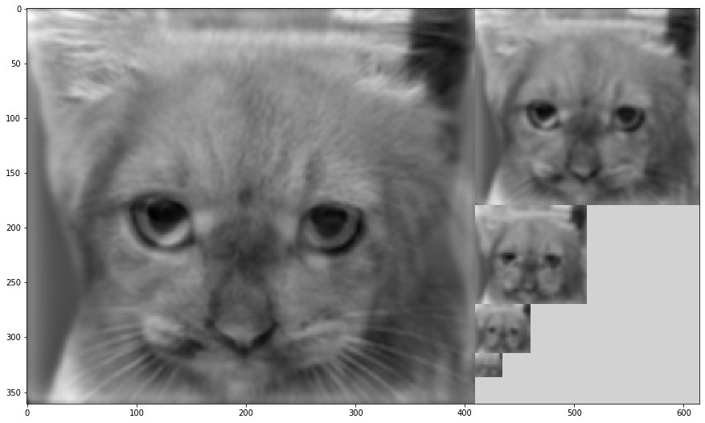

---
title: "Práctica 1"
author: [José Javier Alonso Ramos]
date: "Curso: 2019 - 2020"
subject: "Markdown"
keywords: [Markdown, Example]
subtitle: "Filtrado y detección de regiones"
lang: "es"
titlepage: true
titlepage-rule-height: 1
logo: "/home/jjavier/GII/logoUGR/3.png"
logo-width: 300
toc: TRUE
toc-own-page: TRUE
titlepage-color: e0fbff
titlepage-text-color: 110406
...

## Bibliotecas

\vskip 2em

```python
import sys
import cv2
import matplotlib.pyplot as plt
import numpy as np
```

# Funciones de lectura y mostrado de imágenes

### Función para imprimir imagenes de opencv con matplot  

Deja preparada la imagen _im_, ya sea a color o en escala de grises, para que al hacer _plt.show()_ la muestre por pantalla con el título _title_. Normaliza --> convierte a una escala de color reconocible --> muestra


\vskip 2em

```python
def plt_imshow(im, title = ''):
    
    # NORMALIZAMOS  
    # Si es a color
    if len(im.shape) == 3:
        im[:,:,0] = (im[:,:,0] - np.min(im[:,:,0])) / (np.max(im[:,:,0]) - np.min(im[:,:,0]))*255
        im[:,:,1] = (im[:,:,1] - np.min(im[:,:,1])) / (np.max(im[:,:,1]) - np.min(im[:,:,1]))*255
        im[:,:,2] = (im[:,:,2] - np.min(im[:,:,2])) / (np.max(im[:,:,2]) - np.min(im[:,:,2]))*255
        
    # SI es en ByN normalizamos la imagen entera (solo tiene un canal)
    else:
        im[:,:] = (im[:,:] - np.min(im[:,:])) / (np.max(im[:,:]) - np.min(im[:,:]))*255
        
    # Si la imagen es a color
    if len(im.shape) == 3:
        im_plt = cv2.cvtColor(im,cv2.COLOR_BGR2RGB) # La cambiamos a RGB
        plt.imshow(im_plt) # mostramos
        
    else: # Si es gris
        plt.imshow(im, cmap='gray') # Mostramos en escala de grises
    plt.title(title) # añadimos un título
```

### Función para la lectura de imágenes  

Recive como parámetro el _path_ hasta la imagen y el modo de color de opencv a emplear. Delvuelve la imagen en _float64_ para trabajar con ella.


\vskip 2em

```python
def leer_imagen(path, color = None):

    # Si queremos leer la imagen en BGR
    if color == None:
        im_cv = cv2.imread(path)
        
    # Si queremos leer la imagen en ByN
    elif color == 0:
        im_cv = cv2.imread(path, 0)

    # Devolvemos la imagen para cv y para plt
    return np.float64(im_cv)
```

# Funciones que implementan el funcionamiento de los distintos ejercicios

Para no sobrecargar la memoria con código solo se muestran las cabeceras de las funciones para ver los parámetros que tienen y, también, para que sea más fácil buscarlas en el archivo de código.

## Gaussiana 1D

Obtenemos el kernel de una función Gaussiana de tamaño _kernel\_size_ , $\sigma$ = _sigma_ y bordes de tipo _borde_ y lo aplicamos por filas y columnas a la imagen pasada como parámetro.


\vskip 2em

```python
def Gaussiana1D(im, kernel_size, sigma, borde):

    ...
    
    return im2
```

## Gaussiana 2D 

Obtenemos el kernel de una función Gaussiana de tamaño _kernel\_size_, $\sigma$ = _sigma_ y bordes de tipo _borde_. Tras esto multiplicamos el kernel obtenido por su traspuesta para obneter una máscara 2D para aplicarla a la imagen.


\vskip 2em

```python
def Gaussiana2D(im, kernel_size, sigma, borde):

    ...

    return im2
```

## Sobel (getDerivKernels)

Aplicamos Sobel de tamaño _kernel\_size_ en _x_ e _y_ a la imagen _im_ con configuración de bordes = _borde_ .  
Sobel suaviza la imagen y después calcula su derivada en un determinado eje con la intención de detectar los bordes de la imagen o, más concretamente, los cambios de frecuencia (intensidad de color).  
Obtenemos los kernels de ambos ejes y los multiplicamos matricialmente para obtener una máscara 2D la cual tendremos que voltear en ambos ejes para que al aplicarla realicemos una convolución. Tras esto aplicamos estas máscaras por separado obteniendo dos imágenes una con un resalto de bordes en el eje horizontal y otra en el vertical.


\vskip 2em

```python
def gradiente(im, kernel_size, borde):

    ...

    return im2, im3
```

## Laplaciana de Gaussiana

La Laplaciana de Gaussiana es lo mismo que la segunda derivada de la Gaussiana.  
Recive como parámetro una imagen _im_ a la que aplicar el filtro, un tamaño de máscara _kernel\_size_, un valor de $\sigma$ = _sigma_ para calcular la Gaussiana y un tipo de _borde_ a aplicar.

Primero obtenemos la gaussiana de la imagen y después la derivamos en ambos ejes obteniendo una derivada en el eje x y otra derivada en el eje y. La imagen que queremos es la suma de estas dos.


\vskip 2em

```python
def LoG(im, kernel_size, sigma, borde):
    
    ...
    
    return img
```

## Subsample

Reducimos la imagen pasada como parámetro suprimiendo las filas y columnas pares.


\vskip 2em

```python
def imageSubsample(im):
    
    ...
            
    return im2
```

## Upsample

Aumentamos el tamaño de la imagen pasada como argumento insertando cada fila y columna dos veces


\vskip 2em

```python
def imageUpsample(im):
    
    ...
            
    return im2
```

## Pyramid

Recive como parámetro un vector de 5 imágenes de manera que v[i+1] es el subsample de v[i].  
Crea una imagen en forma de "pirámide" compuesta por las imágenes del vector _v\_img_ con la intención de representarlas de una forma más vistosa y útil que permite compararlas.

En primer lugar crea una serie de imágenes en blanco que actuarán como fondo de las pasadas como parámetro y las complementan para formar una nueva imagen de un tamaño específico que encaje en la composición de la pirámide. Todo el algoritmo está dedicado a ajustar las imágenes con su fondo correspondiente y a concatenarlas entre sí para que al final tenga forma de "pirámide".


\vskip 2em

```python
def pyramid(v_img):
    
    ...

    return final
```

## Hibridación

Recive como parámetro las dos imágenes a hibridar (_im1_, _im2_), así como el tamaño de máscara y el valor de sigma (_kernel1, kernel2, sigma1, sigma2_) que se utilizará para calcular la gaussiana de cada una de ellas.

A la primera imagen solo le calcularemos su Gaussiana, mientras que a la segunda le calcularemos su Gaussiana únicamente como paso intermedio para obtener las frecuencias altas. Una vez tenemos las frecuencias bajas de la primera imagen (su Gaussiana) y las frecuencias altas de la segunda (original - su Gaussiana) sumamos las dos imágenes resultantes para obtener la imagen híbrida. Además, se devuelve junto con la imagen híbrida, una imagen que muestra las dos imágenes procesadas por separado junto con la híbrida.


\vskip 2em

```python
def hybrid(im1, im2, kernel1, kernel2, sigma1, sigma2):
    
    ...
    
    return fin, hyb
```

## Imprime híbrida

Recive como parámetro los mismos argumentos que la función _hybrid_ ya que serán estos mismos los que serán pasados.  
Esta función solo se encarga de leer las dos imágenes que se le pasarán como argumento a la función _hybrid_, llamar a dicha función y mostrar el resultado.


\vskip 2em

```python
def imprimeHybrid(im1, im2, k1, k2, s1, s2):
    
    ...
    
    return hyb
```

## Blob detection

Recibe como parámetros el número de escalas a realizar (cuántas veces modificaremos sigma), la imagen en la que queremos encontrar los _blobs_, un valor inicial de sigma, un tamaño para el kernel y un umbral a partir del cual consideraremos importante el blob detectado.  

Creamos una imagen _fin_ de 0s del mimo tamaño que la original

Para cada una de las escalas:  
- Calcularemos la Laplaciana de Gaussiana de la imagen, la normalizaremos multiplicándola por $\sigma^2$ y elevaremos el resultado al cuadrado.  
- Creamos una matriz (imagen) a la que llamaremos _Z_ del mismo tamaño que la original con todos sus valores a 0 (negro) en la que iremos guardando los blobs detectados.  
- Recorremos la Laplaciana de Gaussiana pixel a pixel comprobando que sea el máximo de su vecindario $3x3$ (es un blob). Si lo es , guardamos ese pixel en la matriz de 0s.
- Una vez hayamos detectado los blobs de la imagen en esa escala de $\sigma$, normalizamos Z y dibujamos un círculo en todos aquellos blobs que superen el valor de umbral pasado.
- Sumamos _fin_ + _Z_
- Aumentamos el valor de sigma $\sigma = 1.4 * \sigma$

Devolvemos la imagen _fin_ que contiene todos los círculos de las diferentes escalas que marcan zonas de interés en la imagen.


\vskip 2em

```python
def blob(escalas, im, sigma, kernel, umbral):
    
    ...
        
    return fin
        
```

## Dibuja círculos

Toma como parámetros una imagen _z_ en la que se pintarán los círculos, un umbral _u_ que marcará en qué puntos se dibujan los círculos, y un sigma _s_ que marcará el tamaño de esos círculos.

Primero nos hacemos con las columnas y filas en las que los valores de la imagen superan el umbral, agrupamos los valores por parejas para pasárselo a la función _circle_ a la que le pasaremos también la imagen _z_, el tamaño del radio que irá definido por el valor de sigma (lo multiplicamos por 15 para que tome un tamaño visible) y el color del que colorearemos el círculo, en este caso blanco (255).


\vskip 2em

```python
def drawCircles(z, u, s):
    
    ...

```

# Ejercicio 1.

## 1a. Máscara Gaussiana aplicada con máscaras 1D y 2D comparadas con la función GaussianBlur. Máscara de Sobel (derivadas - resaltado de bordes) en _x_ e _y_

- **Qué vamos a calcular**  
Vamos a aplicar un filtro de Gaussiana a una imagen de tres maneras distintas: mediante máscaras de una dimensión, máscaras de dos dimensiones y con la función propia de OpenCV _GaussianBlur()_. También aplicaremos el filtro de Sobel en ambos ejes de la imagen.

- **Cómo lo hacemos**  
Los filtros de Sobel los aplicamos con la función _gradiente()_. Para aplicar la Gaussiana utilizaremos las funciones _Gaussiana1D()_, _Gaussiana2D()_ y _cv2.GaussianBlur()_.

- **Funcionamiento de _gradiente()_**  
Esta función suaviza la imagen y después calcula su derivada en ambos ejes con la intención de detectar los bordes de la imagen o, más concretamente, los cambios de frecuencia (intensidad de color). En ella obtenemos dos parejas de kernels (una pareja para cada eje) y multiplicamos los miembros de las parejas matricialmente para obtener dos máscaras 2D la cuales tendremos que voltear en ambos ejes para que al aplicarlas realicemos una convolución. Tras esto aplicamos estas máscaras por separado obteniendo dos imágenes una con un resalto de bordes en el eje horizontal y otra en el vertical.

- **Funcionamiento _Gaussiana1D()_**  
Obtenemos el kernel de una función Gaussiana de tamaño _kernel\_size_ , $\sigma$ = _sigma_ y bordes de tipo _borde_ y lo aplicamos una vez por filas y otra vez por columnas a la imagen pasada como parámetro.

- **Funcionamiento _Gaussiana2D()_**  
Obtenemos el kernel de una función Gaussiana de tamaño _kernel\_size_, $\sigma$ = _sigma_ y bordes de tipo _borde_. Tras esto multiplicamos el kernel obtenido por su traspuesta para obneter una máscara 2D para así aplicarla una única vez a la imagen.

- **Parámetros**  
>**kernels = [3,15,31]**:  El tamaño máximo de máscara en las funciones Gaussianas es 31 por lo que se intenta escoger valores que representen todo el dominio viable pero sin que sean demasiados como para que haya muchas ejecuciones.  
 **k_size = [1,5,7]**:  Tenemos algo parecido al caso anterior salvo que el valor máximo en la función _gradiente()_ es 7.  
 **sigmas = [1, 3, 9]**:  Con estos tres valores de sigma acompañados de los valores de kernel se ve perfectamente como a medida que aumentamos el valor de $\sigma$ y _kernel_ el difuminado es mayor. No hace falta irnos a valores de $\sigma$ muy alto para obtener un buen emborronamiento.
 **bordes = [cv2.BORDER_CONSTANT, cv2.BORDER_DEFAULT]**: De entre todos los tipos de bordes que ofrece OpenCV estos dos muestran diferencias apreciables a simple vista. El vorde constante rellena la imagen con un número fijo (por defecto 0) mientras que el borde por defecto refleja la imagen para completar los bordes.


\vskip 2em

```python
def ejer1a():
    # Leemos imagen en ByN
    im = leer_imagen('imagenes/cat.bmp', 0)
    im_orig = np.copy(im)

    # Predefinimos los valores del tamaño de la máscara (para gaussianas y para Sobel),
    # el valor de sigma para las Gaussianas y
    # el tipo de bordes 
    kernels = [3,15,31]
    k_size = [1,5,7]
    sigmas = [1, 3, 9]

    # Borde constante: rellena con 0s
    # Borde reflect: expande en espejo los bordes de la imagen --> abcd | dcba
    # Borde default: expande en espejo los bordes de la imagen pero no replica el píxel del límite --> abcd | cba
    bordes = [cv2.BORDER_CONSTANT, cv2.BORDER_DEFAULT]
    str_bordes = ['BORDER_CONSTANT', 'BORDER_DEFAULT']

    for i in range(len(kernels)):
        for j in sigmas:
            for k in range(len(bordes)):
                #input('Intro para kernel-gauss = ' + str(kernels[i]) + '\nkernel-sobel = ' +
                 #     str(k_size[i]) + '\nsigma = ' + str(j) + '\nbordes = ' + str_bordes[k])

                im_grad1, im_grad2 = gradiente(im, k_size[i], bordes[k])
                im_1d = Gaussiana1D(im, kernels[i], j, bordes[k])
                im_2d = Gaussiana2D(im, kernels[i], j, bordes[k])
                im_gauss = cv2.GaussianBlur(im, (kernels[i],kernels[i]), j, borderType=k)

                plt.figure(num=None, figsize=(15,15)) # Establecemos el tamaño de la imagen
                # Ponemos un título general
                plt.suptitle('kernel-gauss = ' + str(kernels[i]) + '\nkernel-sobel = ' +
                             str(k_size[i]) + '\nsigma = ' + str(j) + '\nbordes = ' + str_bordes[k])
                # Realizamos un subplot y para cada sub-imagen añadimos un título
                plt.subplot(4,3,1)
                plt_imshow(im_orig, 'Original')
                plt.subplot(4,3,2)
                plt_imshow(im_grad1,'Sobel en x')
                plt.subplot(4,3,3)
                plt_imshow(im_grad2, 'Sobel en y')
                plt.subplot(4,3,4)
                plt_imshow(im_grad1 + im_grad2, 'Sobel x+y')
                plt.subplot(4,3,5)
                plt_imshow(im_1d, '1D masks')
                plt.subplot(4,3,6)
                plt_imshow(im_2d, '2D mask')
                plt.subplot(4,3,7)
                plt_imshow(im_gauss, 'cv2 Gaussian')
                plt.show()
```


\vskip 2em

```python
ejer1a()
```


En las imágenes podemos notar que a mayor $\sigma$ y a mayor tamaño de máscara más se emborrona las imágenes con filtro de Gaussiana. Además si el tipo de borde es CONSTANT en las imágenes con filtro de Gaussiana y tamaño de kernel grande se aprecia un borde negro en los marcos de la imagen.  
En las imágenes con filtro Sobel vemos como sólo afecta el tipo de borde y el tamaño del kernel. Las imágenes están mucho más definidas a mayor tamaño de máscara y cuando el tipo de borde definido es DEFAULT.


## 1b. Cálculo de una convolución 2D con una máscara _Laplaciana de Gaussiana_

- **Qué vamos a calcular**  
Vamos a aplicar un filtro de Laplaciana de Gaussiana a una imagen.

- **Cómo lo hacemos**  
El filtro lo aplicaremos con la función _LoG()_. La Laplaciana de Gaussiana es lo mismo que la segunda derivada de la Gaussiana. Primero obtenemos la gaussiana de la imagen y después la derivamos en ambos ejes obteniendo una derivada en el eje x y otra derivada en el eje y. La imagen que queremos es la suma de estas dos.

- **Parámetros**  
>**kernels = [3,15,31]**:  El tamaño máximo de máscara en las funciones Gaussianas es 31 por lo que se intenta escoger valores que representen todo el dominio viable pero sin que sean demasiados como para que haya muchas ejecuciones.  
 **sigmas = [1, 3, 9]**:  Con estos tres valores de sigma acompañados de los valores de kernel se ve perfectamente como a medida que aumentamos el valor de $\sigma$ y _kernel_ el difuminado es mayor. No hace falta irnos a valores de $\sigma$ muy alto para obtener un buen emborronamiento.
 **bordes = [cv2.BORDER_CONSTANT, cv2.BORDER_DEFAULT]**: De entre todos los tipos de bordes que ofrece OpenCV estos dos muestran diferencias apreciables a simple vista. El vorde constante rellena la imagen con un número fijo (por defecto 0) mientras que el borde por defecto refleja la imagen para completar los bordes.


\vskip 2em

```python
def ejer1b():
    im = leer_imagen('imagenes/motorcycle.bmp', 0)

    kernels = [3,15,31]
    sigmas = [1, 3]

    # Borde constante: rellena con 0s
    # Borde reflect: expande en espejo los bordes de la imagen --> abcd | dcba
    # Borde default: expande en espejo los bordes de la imagen pero no replica el píxel del límite --> abcd | cba
    bordes = [cv2.BORDER_CONSTANT, cv2.BORDER_DEFAULT]
    str_bordes = ['BORDER_CONSTANT', 'BORDER_DEFAULT']

    for i in range(len(kernels)):
        for j in sigmas:
            for k in range(len(bordes)):
                #input('kernel = ' + str(kernels[i]) + '\nsigma = ' + str(j) + '\nbordes = ' + str_bordes[k])
                
                img_lap = LoG(im,kernels[i],j,bordes[k])

                plt.suptitle('kernel = ' + str(kernels[i]) + '\nsigma = ' + str(j) + '\nbordes = ' + str_bordes[k])
                plt.title('Laplacian')
                plt_imshow(img_lap)
                plt.show()
```


\vskip 2em

```python
ejer1b()
```


Como antes, si el tamaño de máscara es suficientemente grande y el tipo de borde es CONSTANT aparece un marco negro en la imagen.  
Vemos que la Laplaciana de Gaussiana muestra mejores resultados, al menos en este caso, cuando el kernel y $\sigma$ son lo suficientemente pequeños para difuminar los bordes más "afilados" que son los que luego mostrarán las imágenes pero no bordes menos importantes que luego destorsionarán la imagen.


# Ejercicio 2.


## 2a. Pirámide Gaussiana de 4 niveles

- **Qué vamos a calcular**  
Vamos a realizar una pirámide Gaussiana de 4 niveles (5 imágenes suponiendo como nivel 0 el tamaño original).

- **Cómo lo hacemos**  
Para hacer la pirámide Gaussiana nos ayudaremos de tres funciones: _Gaussiana1D()_, _imageSubsample()_ y _pyramid()_. Primero aplicamos la Gaussiana a la imagen y la guardamos como un nivel de la pirámide, disminuimos la imagen con _imageSubsample()_ y repetimos hasta cubrir los 4 niveles (5 contando el 0). Una vez tengamos todas las imágenes _pyramid()_ se encargará de ordenarlas adecuadamente y mostrarlas en forma de pirámide.

- **Funcionamiento _Gaussiana1D()_**  
Obtenemos el kernel de una función Gaussiana de tamaño _kernel\_size_ , $\sigma$ = _sigma_ y bordes de tipo _borde_ y lo aplicamos una vez por filas y otra vez por columnas a la imagen pasada como parámetro.

- **Funcionamiento _imageSubsample()_**  
La imagen que se le pasa como parámetro es reducida a la mitad de columnas y filas.

- **Funcionamiento pyramid()_**  
Crea una imagen en forma de "pirámide" compuesta por las imágenes pasadas como parámetro con la intención de representarlas de una forma más vistosa y útil que permite compararlas. En primer lugar crea una serie de imágenes en blanco que actuarán como fondo de las pasadas como parámetro y las complementan para formar una nueva imagen de un tamaño específico que encaje en la composición de la pirámide. Todo el algoritmo está dedicado a ajustar las imágenes con su fondo correspondiente y a concatenarlas entre sí para que al final tenga forma de "pirámide".

- **Parámetros**  
 >**bordes = [cv2.BORDER_CONSTANT, cv2.BORDER_DEFAULT]**: De entre todos los tipos de bordes que ofrece OpenCV estos dos muestran diferencias apreciables a simple vista. El vorde constante rellena la imagen con un número fijo (por defecto 0) mientras que el borde por defecto refleja la imagen para completar los bordes.  
 **sigma = 3**: Es un valor suficiente para conseguir emborronamiento.  
 **kernel = 19**: Por la teoría de calidad _Six Sigma_ ($19 = 6*\sigma+1$)
 


\vskip 2em

```python
def ejer2a():
    im = leer_imagen('imagenes/motorcycle.bmp', 0)
    bordes = [cv2.BORDER_DEFAULT, cv2.BORDER_CONSTANT]
    str_bordes = ['BORDER_CONSTANT', 'BORDER_DEFAULT']
    
    for b in range(len(bordes)):
        im2 = np.copy(im)
        v_imgs = []
        for i in range(5):
            im2 = Gaussiana2D(im2, 19, 3, bordes[b])
            v_imgs.append(im2)
            im2 = imageSubsample(im2)
        p = pyramid(v_imgs)
        plt.figure(num=None, figsize=(15,15)) # Establecemos el tamaño de la imagen
        plt_imshow(p)
        plt.title(str_bordes[b])
        plt.show()
```


\vskip 2em

```python
ejer2a()
```


De nuevo vemos la presencia del marco negro cuando utilizamos borde CONSTANT.


## 2b. Pirámide Laplaciana de 4 niveles

- **Qué vamos a calcular**  
Vamos a realizar una pirámide Laplaciana de 4 niveles (5 imágenes suponiendo como nivel 0 el tamaño original).

- **Cómo lo hacemos**  
Para hacer la pirámide Laplaciana nos ayudaremos de cuatro funciones: _Gaussiana1D()_, _imageSubsample()_ , _imageUpsample()_ y _pyramid()_. Primero aplicamos la Gaussiana a la imagen, la disminuimos con _imageSubsample()_, la aumentamos con _imageUpsample()_, ajustamos las dimensiones para que vuelvan a ser las originales y restamos la imagen modificada a la original para obtener la laplaciana. Guaradamos este resultado y repetimos hasta cubrir los 4 niveles (5 contando el 0). Una vez tengamos todas las imágenes _pyramid()_ se encargará de ordenarlas adecuadamente y mostrarlas en forma de pirámide.

- **Funcionamiento _Gaussiana1D()_**  
Obtenemos el kernel de una función Gaussiana de tamaño _kernel\_size_ , $\sigma$ = _sigma_ y bordes de tipo _borde_ y lo aplicamos una vez por filas y otra vez por columnas a la imagen pasada como parámetro.

- **Funcionamiento _imageSubsample()_**  
La imagen que se le pasa como parámetro es reducida a la mitad de columnas y filas.

- **Funcionamiento _imageUpsample()_**  
Aumentamos el tamaño de la imagen pasada como argumento insertando cada fila y columna dos veces

- **Funcionamiento pyramid()_**  
Crea una imagen en forma de "pirámide" compuesta por las imágenes pasadas como parámetro con la intención de representarlas de una forma más vistosa y útil que permite compararlas. En primer lugar crea una serie de imágenes en blanco que actuarán como fondo de las pasadas como parámetro y las complementan para formar una nueva imagen de un tamaño específico que encaje en la composición de la pirámide. Todo el algoritmo está dedicado a ajustar las imágenes con su fondo correspondiente y a concatenarlas entre sí para que al final tenga forma de "pirámide".

- **Parámetros**  
 >**bordes = [cv2.BORDER_CONSTANT, cv2.BORDER_DEFAULT]**: De entre todos los tipos de bordes que ofrece OpenCV estos dos muestran diferencias apreciables a simple vista. El vorde constante rellena la imagen con un número fijo (por defecto 0) mientras que el borde por defecto refleja la imagen para completar los bordes.  
 **sigma = 3**: Es un valor suficiente para conseguir emborronamiento.  
 **kernel = 19**: Por la teoría de calidad _Six Sigma_ ($19 = 6*\sigma+1$)


\vskip 2em

```python
def ejer2b():
    im = leer_imagen('imagenes/einstein.bmp', 0)
    bordes = [cv2.BORDER_CONSTANT, cv2.BORDER_REFLECT]
    str_bordes = ['BORDER_CONSTANT', 'BORDER_DEFAULT']
    
    for b in bordes:
        im2 = np.copy(im)
        v_imgs = []
        for i in range(5):
            im3 = Gaussiana1D(im2, 5, 3, b)
            im3 = imageSubsample(im3)
            im4 = imageUpsample(im3)
            
            if im2.shape[1] != im4.shape[1]:
                dif = im2.shape[1] - im4.shape[1]
                relleno = np.zeros((im4.shape[0], dif))
                im4 = np.concatenate((im4, relleno), axis=1)
            if im2.shape[0] != im4.shape[0]:
                dif = im2.shape[0] - im4.shape[0]
                relleno = np.zeros((dif, im2.shape[1]))
                im4 = np.concatenate((im4, relleno), axis=0)
            
            v_imgs.append(im2-im4)
            im2 = im3
        p = pyramid(v_imgs)
        plt.figure(num=None, figsize=(15,15)) # Establecemos el tamaño de la imagen
        plt.title('')
        plt_imshow(p)
        plt.show()
```


\vskip 2em

```python
ejer2b()
```


En este caso el usar distintos tipos de bordes no afecta al resultado, al menos a simple vista.


## 2c. Blob Detection

- **Qué vamos a calcular**  
Vamos a realizar la detección de puntos de interés de una imagen

- **Cómo lo hacemos**  
Este problema lo resolveremos con la función _blob()_

- **Funcionamiento _blob()_**  

Recibe como parámetros el número de escalas a realizar (cuántas veces modificaremos sigma), la imagen en la que queremos encontrar los _blobs_, un valor inicial de sigma, un tamaño para el kernel y un umbral a partir del cual consideraremos importante el blob detectado.  

Creamos una imagen _fin_ de 0s del mimo tamaño que la original

Para cada una de las escalas:  
- Calcularemos la Laplaciana de Gaussiana de la imagen, la normalizaremos multiplicándola por $\sigma^2$ y elevaremos el resultado al cuadrado.  
- Creamos una matriz (imagen) a la que llamaremos _Z_ del mismo tamaño que la original con todos sus valores a 0 (negro) en la que iremos guardando los blobs detectados.  
- Recorremos la Laplaciana de Gaussiana pixel a pixel comprobando que sea el máximo de su vecindario $3x3$ (es un blob). Si lo es , guardamos ese pixel en la matriz de 0s.
- Una vez hayamos detectado los blobs de la imagen en esa escala de $\sigma$, normalizamos Z y dibujamos un círculo en todos aquellos blobs que superen el valor de umbral pasado.
- Sumamos _fin_ + _Z_
- Aumentamos el valor de sigma $\sigma = 1.4 * \sigma$

Devolvemos la imagen _fin_ que contiene todos los círculos de las diferentes escalas que marcan zonas de interés en la imagen.

- **Parámetros**  
 >**escalas = 3**: Con 3 escalas distintas se reconocen los principales puntos de interés de la imagen en cuestión. Con mayor número de escalas satura la imagen con círculos que, subjetivamente, aportan poco.  
 **sigma = 1.8**: A base de prueba y error es un valor que da buenos resultados.  
 **kernel = 15**: A base de prueba y error es un valor que da buenos resultados.  
 **umbral = 120**: A base de prueba y error es un valor que da buenos resultados.


\vskip 2em

```python
def ejer2c():
    im = leer_imagen('imagenes/marilyn.bmp', 0)
    puntos_calientes = blob(3,im,1.8,15, 120)
    plt.figure(num=None, figsize=(15,15)) # Establecemos el tamaño de la imagen
    plt_imshow(puntos_calientes+im)
    plt.show()
```


\vskip 2em

```python
ejer2c()
```


Vemos que a mayor escala de sigma son más los puntos de interés que encuentra el algoritmo y que la importancia (subjetiva) de los mismos parece ser inversa a la escala en la que aparecen. Desde la escala 1 hasta la 3 se identifican los ojos como zonas de interés.


# Ejercicio 3.

## 3. Imágenes Híbridas

- **Qué vamos a calcular**  
Vamos a realizar la hibridación de dos imágenes. Una de altas frecuencias y otra de bajas para comprobar que al aumentar o disminuir la distancia con la que las observamos somos capaces de ver una u otra.

- **Cómo lo hacemos**  
Este problema lo resolveremos con la función _hybrid()_ la cual es llamada por _imprimeHybrid()_. Estas funciones nos devuelven las imágenes híbridas que luego convertiremos a pirámide Gaussiana con el mismo procedimiento que en el ejercicio 2a.

- **Funcionamiento _hybrid()_**  
Recive como parámetro las dos imágenes a hibridar (_im1_, _im2_), así como el tamaño de máscara y el valor de sigma (_kernel1, kernel2, sigma1, sigma2_) que se utilizará para calcular la gaussiana de cada una de ellas.

A la primera imagen solo le calcularemos su Gaussiana, mientras que a la segunda le calcularemos su Gaussiana únicamente como paso intermedio para obtener las frecuencias altas. Una vez tenemos las frecuencias bajas de la primera imagen (su Gaussiana) y las frecuencias altas de la segunda (original - su Gaussiana) sumamos las dos imágenes resultantes para obtener la imagen híbrida.

- **Funcionamiento _imprimeHybrid()_**  
Recive como parámetro los mismos argumentos que la función _hybrid()_ ya que serán estos mismos los que serán pasados.  
Esta función solo se encarga de leer las dos imágenes que se le pasarán como argumento a la función _hybrid_, llamar a dicha función y mostrar el resultado.

- **Parámetros**  
 >Para cada pareja de imágenes se han escogido distintos sigmas y tamaños de máscara pero de todos se ha partido probando con $\sigma=3$ y máscara $= 6 * \sigma + 1$. A partir de ahí se ha ido jugando con los valores según requiriesen mayor o menor difuminación.  
 <sigma img1, sigma img2, kernel_size img1, kernel_size img2>
 **Pareja 1**: 19,17,3,5  
 **Pareja 2**: 15,7,5,5  
 **Pareja 3**: 13,61,3,15  
 **Pareja 4**: 13,20,2,7  
 **Pareja 5**: 31,61,5,10  
 Para la pirámide Gaussiana:  
 **sigma = 3**: A base de prueba y error es un valor que da buenos resultados.  
 **kernel = 5**: A base de prueba y error es un valor que da buenos resultados.  


\vskip 2em

```python
def ejer3():
    v_img = []
    
    im1 = imprimeHybrid('imagenes/bird.bmp', 'imagenes/plane.bmp', 19,17,3,5)
    im2 = imprimeHybrid('imagenes/motorcycle.bmp', 'imagenes/bicycle.bmp', 15,7,5,5)
    im3 = imprimeHybrid('imagenes/dog.bmp', 'imagenes/cat.bmp', 13,61,3,15)
    im4 = imprimeHybrid('imagenes/einstein.bmp', 'imagenes/marilyn.bmp', 13,20,2,7)
    im5 = imprimeHybrid('imagenes/fish.bmp', 'imagenes/submarine.bmp', 31,61,5,10)
    plt.show()
    
    v_img.append(im1)
    v_img.append(im2)
    v_img.append(im3)
    v_img.append(im4)
    v_img.append(im5)
    
    for img in v_img:
        v_pyramid = []
        im = img
        for i in range(5):
            im = Gaussiana1D(im, 5, 3, cv2.BORDER_REFLECT)
            v_pyramid.append(im)
            im = imageSubsample(im)
            
        p = pyramid(v_pyramid)
        plt.figure(num=None, figsize=(15,15)) # Establecemos el tamaño de la imagen
        plt_imshow(p)
        plt.show()
        
```


\vskip 2em

```python
ejer3()
```





Con este ejercicio queda claro que hay imágenes más fáciles de hibridar que otras. Por ejemplo perro/gato y pez/submarino son imágenes complicadas, pero pájaro/avión o bici/moto son más fáciles de combinar.  
Con las pirámides vemos que en la imagen más grande es más reconocible la imagen de frecuencias altas y a medida que disminuye toma fuerza la imagen de frecuencias bajas.

# Bonus.

## Bonus3. Hibridación con imágenes propias

- **Qué vamos a calcular**  
Vamos a hacer lo mismo que en el ejercicio 3 con la diferencia de que las imágenes son escogidas por mí y no coinciden en dimensiones.

- **Cómo lo hacemos**  
El procedimiento es el mismo que en el ejercicio 3 salvo que antes de llamar a las funciones de hibridación debemos asegurarnos de que las dimensiones de ambas imágenes son la misma. Para ello restamos a la imagen más grande tantas filas y columnas como sean necesarias hasta ajustarse a la imagen más pequeña.

- **Parámetros**  
 > <sigma img1, sigma img2, kernel_size img1, kernel_size img2>
 **Pareja**: 25, 31, 4, 5  
 Para la pirámide Gaussiana:  
 **sigma = 3**: A base de prueba y error es un valor que da buenos resultados.  
 **kernel = 5**: A base de prueba y error es un valor que da buenos resultados.  


\vskip 2em

```python
def bonus3():    
    zelda = leer_imagen('imagenes/zelda.png', 0)
    link = leer_imagen('imagenes/link.png', 0)
    
    dif1 = zelda.shape[0] - link.shape[0]
    dif2 = zelda.shape[1] - link.shape[1]
    
    l11 = int(dif1 // 2)
    l12 = int(dif1 - l11)
    
    l21 = int(dif2 // 2)
    l22 = int(dif2 - l21)
    
    new_zelda = zelda[l11 : zelda.shape[0] - l12, l21 : zelda.shape[1] - l22]
    
    mix, hyb = hybrid(new_zelda, link, 25, 31, 4, 5)
    plt.figure(num=None, figsize=(15,15)) # Establecemos el tamaño de la imagen
    plt_imshow(mix)
    
    v_pyramid = []
    im = hyb
    for i in range(5):
        im = Gaussiana1D(im, 5, 3, cv2.BORDER_REFLECT)
        v_pyramid.append(im)
        im = imageSubsample(im)

    p = pyramid(v_pyramid)
    plt.figure(num=None, figsize=(15,15)) # Establecemos el tamaño de la imagen
    plt_imshow(p)
    plt.show()
```


\vskip 2em

```python
bonus3()
```


