# Ejercicio 1: BaseNet en CIFAR100

Implementamos un modelo base (_BaseNet_) para trabajar con el conjunto de imágenes **CIFAR100**.  
El conjunto inicial se ha modificado para que el número de **clases sea 25** y se ha dividido en **12500 imágenes para realizar el entrenamiento** del modelo y **2500 para el conjunto de prueba** (test). De esas 12500 imágenes de entrenamiento reservaremos un 10% **(1250) para realizar la validación** del modelo según lo vamos entrenando.  
El modelo _BaseNet_ viene definido por la siguente configuración de capas:  
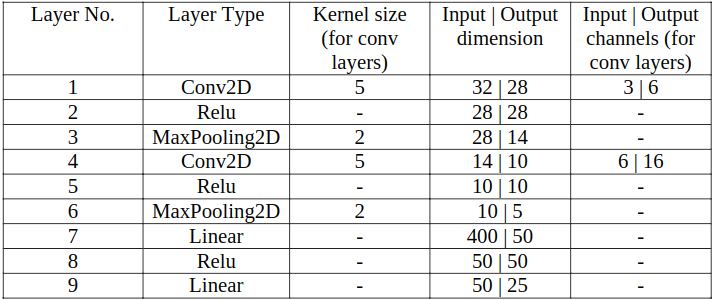{width=400}    

\vskip 2em

```python
model = Sequential()
model.add(Conv2D(6, kernel_size=(5, 5),
                activation='relu',
                input_shape=(32, 32,3)))
model.add(MaxPooling2D(pool_size=(2, 2)))
model.add(Conv2D(16, kernel_size=(5, 5),
                 activation='relu',
                 input_shape=(14,14,6)))
model.add(MaxPooling2D(pool_size=(2, 2)))
model.add(Flatten())
model.add(Dense(50, activation='relu'))
model.add(Dense(25, activation='softmax'))
```

Acontinuación mostraremos algunos resultados obtenidos con distintos parámetros en en modelo. Vamos a probar distintas cantidades de épocas y dos tipos de optimizadores: SGD y una variación del mismo, Adam, que ajusta el _learning rate_ dependiendo de la distribución de los datos.  ç

- **Optimizador:** SGD
- **Épocas:** 20
- **Batch size:** 64
- **Precisión final en test:** 0.3176000118255615
- **Pérdida final en test:** 2.35547516746521


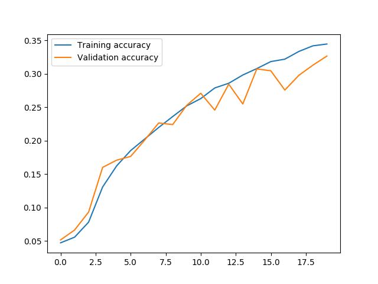{width=400}      
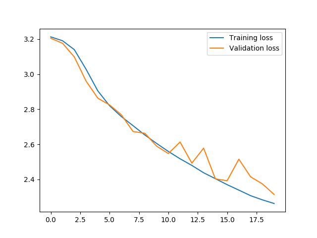{width=400}      

- **Optimizador:** SGD
- **Épocas:** 40
- **Batch size:** 64
- **Precisión final en test:** 0.35119998574256897
- **Pérdida final en test:** 2.1934714401245117

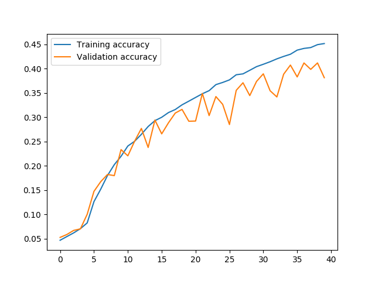{width=400}    
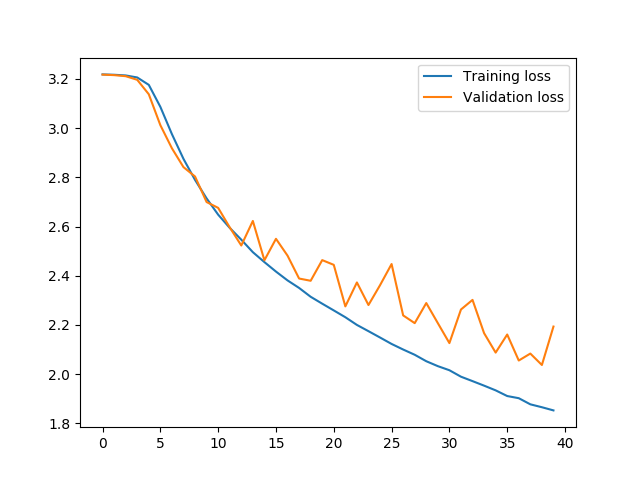{width=400}      

- **Optimizador:** Adam
- **Épocas:** 20
- **Batch size:** 64
- **Precisión final en test:** 0.40680001378059387
- **Pérdida final en test:** 1.9854614252090454


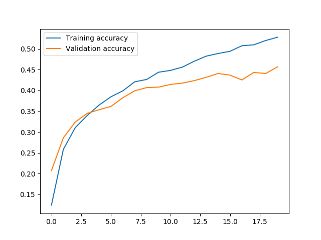{width=400}    
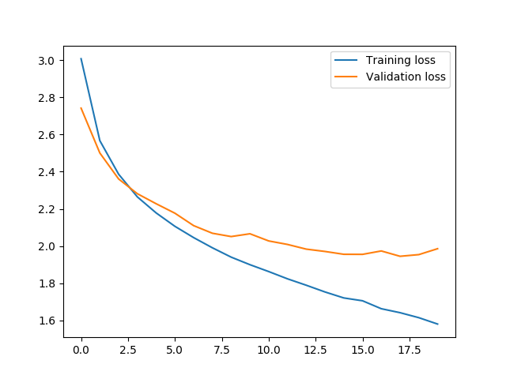{width=400}      

- **Optimizador:** Adam
- **Épocas:** 40
- **Batch size:** 64
- **Precisión final en test:** 0.4364000041484833
- **Pérdida final en test:** 1.8760112937927247

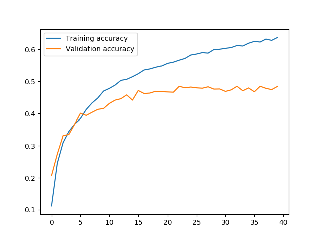{width=400}    
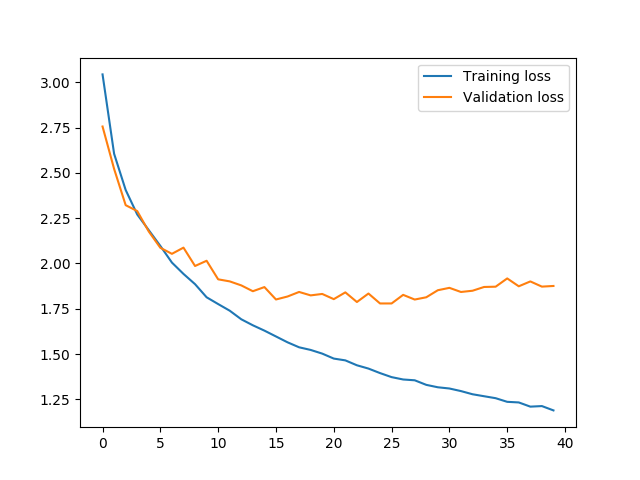{width=400}    

Podemos ver que el optimizador Adam se comporta en ambos tamaños de épocas bastante mejor que SDG() siendo un 14% y un 10% mejor en las respectivas pruebas. En las gráficas observamos que a major resultado en en el conjunto _test_ peor resultado se obtiene en validación. Esto es porque al producirse menos _overfitting_ la red es capaz de clasificar adecuadamente elementos que no se encuantran en el grupo training.  

# Ejercicio 2: Mejora del modelo

## 1.- Normalización de los datos
Antes de empezar con el apartado, restauramos los pesos obtenidos en el apartado anterior para que la comparación de los resultados sea algo razonable.
Para normalizar los datos utilizaremos la clase ImageDataGenerator con los parámetros _featurewise_center = True_ para tener media = 0, y _featurewise_std_normalization = True_ para tener desviación = 1.

Para el conjunto de train creamos un generador en el que añadimos además el parámetro _validation_split = 0.1_ para obtener un subconjunto de validación del 10%.  

\vskip 2em

```python
datagen = ImageDataGenerator(featurewise_center=True,
                             validation_split = 0.1,
                             featurewise_std_normalization = True)
```
Para el conjunto test no es necesario hacer el split.

\vskip 2em

```python
datagen_test = ImageDataGenerator(featurewise_center=True,
                                featurewise_std_normalization = True)
```
Ajustamos los generadores a los datos de entrenamiento

\vskip 2em

```python
datagen.fit(x_train)
datagen_test.fit(x_train)
```

A la hora de entrenar el modelo incluiremos los parámetros _steps_per_epoch_ que indica las variaciones de batches ocurridas antes de acabe la época en el conjunto de training, y _validation\_steps_ que es lo mismo que el parámetro anterior pero en el conjunto de validación.

\vskip 2em

```python

historia = model.fit_generator(datagen.flow(x_train ,y_train, batch_size = batch_size, subset = 'training'),
                    validation_data = datagen.flow(x_train, y_train ,batch_size = 32,subset ='validation'),
                    epochs = epochs,
                    steps_per_epoch = len(x_train)*0.9/batch_size,
                    validation_steps = len(x_train )*0.1/batch_size)
```

- **Optimizador:** Adam
- **Épocas:** 30
- **Batch size:** 32
- **Precisión final en test:** 0.4412000041484833
- **Pérdida final en test:** 2.5223891834259033

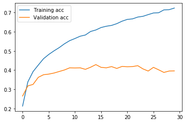{width=400}  
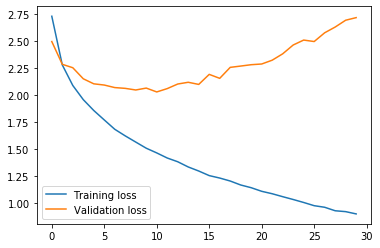{width=400}  

Hemos reducido el número de épocas y el tamaño del batch ya que se obtenían resultados muy parecidos y ahorramos tiempo de ejecución.  
Apreciamos una ligera mejora de unas pocas centésimas en la precisión del modelo. Vamos a ver como en el siguiente aprtado si mejora algo más.

## 2.- Aumento de datos

Vamos a aplicar data augmentation al conjunto de datos para crear nuevas imágenes que aporten nueva información al modelo. Usaremos los parámetros _zoom_range y horizontal_flip_ en el generador de imágenes. El parámetro que realiza el flip horizontal lo podemos usar ya que el conjunto de imágenes sobre el que trabajamos es de pájaros y no afecta que la imagen se vea espejada (sigue siendo un pájaro) cosa que no ocurre, por ejemplo, con los números. Si hacemos un flip horizontal a un 3 deja de ser un tres.

\vskip 2em

```python
datagen = ImageDataGenerator(featurewise_center=True,
                             validation_split = 0.1,
                             featurewise_std_normalization = True,
                             zoom_range=0.2,
                             horizontal_flip=True)
```

El valor de zoom_range = 0.2 es suficiente para provocar un cambio en la imagen y acercarnos a la zona de interés sin que este acercamiento sea desmesurado y "perdamos de vista" las características importantes.  
Añadiendo la aumentación de datos obtenemos una considerable mejora:  

- **Optimizador:** Adam
- **Épocas:** 30
- **Batch size:** 32
- **Precisión final en test:** 0.5088
- **Pérdida final en test:** 1.695417333984375

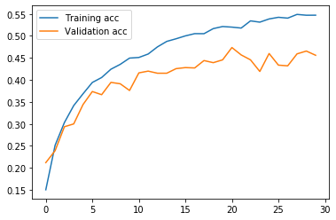{width=400}  
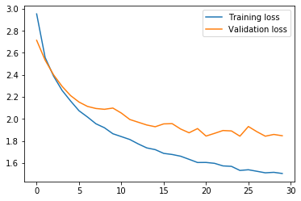{width=400}  

Hemos mejorado unas 6 décimas en la precisión del modelo alcanzando la puntuación objetivo de un 50% de precisión que pedía el apartado.  

## 3.- Red más profunda

Vamos a aumentar el tamaño de la red añadiendo capas convolucionales a la red BaseNET además de capas totalmente conectadas.

Num | Capa
----|-----
1 | Conv2D(6, kernel = 5, input = (32,32,3))
2 | Relu
3 | Conv2D(16, kernel = 3, padding = 'same')
4 | Relu
5 | MaxPooling(pool_size = 2)
6 | Conv2D(16, kernel = 3, padding = 'same')
7 | Relu
8 | Conv2D(24, kernel = 3, padding = 'same')
9 | Relu
10| Conv2D(32, kernel = 5)
11| Relu
12| MaxPooling(pool_size = 2)
13| Flatten()
14| Dense(100)
15| Relu
16| Dense(50)
17| Relu
18| Dense(25)
19| Softmax

He decidido añadir convoluciones 2D con padding para evitar una reducción del tamaño de las imágenes demasiado grande y me he limitado a dos capas MaxPooling por el mismo motivo. El hecho de que el tamaño del kernel en las nuevas convoluciones sea 3 es debido a que podemos concatenar tantas como queramos para simular kernels mayores pero con una velocidad de cómputo más rápida. Por último se ha añadido una capa Dense Que permite una mayor activación de características a priori que luego serán filtradas.

\vskip 2em

```python
model_extended = Sequential()
model_extended.add(Conv2D(6, kernel_size=5,
				 activation='relu',
				 input_shape=(32, 32,3)))
model_extended.add(Conv2D(16, kernel_size=3,
                 activation='relu',
                 padding='same'))
model_extended.add(MaxPooling2D(pool_size=2))
model_extended.add(Conv2D(16, kernel_size=3,
                 activation='relu',
                 padding='same'))
model_extended.add(Conv2D(24, kernel_size=3,
                 activation='relu',
                 padding='same'))
model_extended.add(Conv2D(32, kernel_size=5,
                 activation='relu'))
model_extended.add(MaxPooling2D(pool_size=2))
model_extended.add(Flatten())
model_extended.add(Dense(100, activation='relu'))
model_extended.add(Dense(50, activation='relu'))
model_extended.add(Dense(25, activation='softmax'))
```

- **Optimizador:** Adam
- **Épocas:** 30
- **Batch size:** 32
- **Precisión final en test:** 0.4816
- **Pérdida final en test:** 1.8888783222198486  

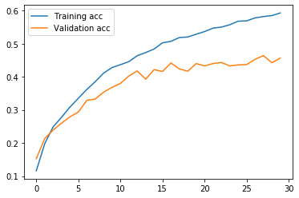{width=400}   
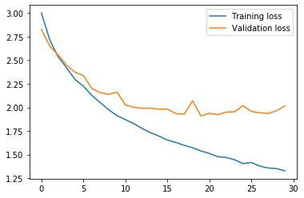{width=400}  

Hemos perdido dos décimas en la implementación de nuevas capas, pero no es un dato realmente significativo ya que los pesos utilizados no son los mismos que en apartados anteriores. Al cambiar la composición de capas de la red el número y valor de los pesos no pueden ser los mismos. Por ello, puede ser que con otros pesos aleatorios logremos suplir esas dos décimas de diferencia o incluso superarlas.

## 4.- Capas de normalización

Vamos a incluir capas de normalización en la red. Estas capas tienen el nombre de _BatchNormalization_ y las incluiremos justo después de las capas de convolución y comlpetamente conectadas.

### 4.1.- Normalización antes de ReLU

Num | Capa
----|-----
1 | Conv2D(6, kernel = 5, input = (32,32,3))
new | BatchNormalization
2 | Relu
3 | Conv2D(16, kernel = 3, padding = 'same')
new | BatchNormalization
4 | Relu
5 | MaxPooling(pool_size = 2)
6 | Conv2D(16, kernel = 3, padding = 'same')
new | BatchNormalization
7 | Relu
8 | Conv2D(24, kernel = 3, padding = 'same')
new | BatchNormalization
9 | Relu
10| Conv2D(32, kernel = 5)
new | BatchNormalization
11| Relu
12| MaxPooling(pool_size = 2)
13| Flatten()
14| Dense(100)
new | BatchNormalization
15| Relu
16| Dense(50)
new | BatchNormalization
17| Relu
18| Dense(25)
19| Softmax

\vskip 2em

```python
model_normalized = Sequential()
model_normalized.add(Conv2D(6, kernel_size=5,
				 input_shape=(32, 32,3)))
model_normalized.add(BatchNormalization())
model_normalized.add(ReLU())
model_normalized.add(Conv2D(16, kernel_size=3,
                 padding='same'))
model_normalized.add(BatchNormalization())
model_normalized.add(ReLU())
model_normalized.add(MaxPooling2D(pool_size=2))
model_normalized.add(Conv2D(16, kernel_size=3,
                 padding='same'))
model_normalized.add(BatchNormalization())
model_normalized.add(ReLU())
model_normalized.add(Conv2D(24, kernel_size=3,
                 padding='same'))
model_normalized.add(BatchNormalization())
model_normalized.add(ReLU())
model_normalized.add(Conv2D(32, kernel_size=5))
model_normalized.add(BatchNormalization())
model_normalized.add(ReLU())
model_normalized.add(MaxPooling2D(pool_size=2))
model_normalized.add(Flatten())
model_normalized.add(Dense(100))
model_normalized.add(BatchNormalization())
model_normalized.add(ReLU())
model_normalized.add(Dense(50))
model_normalized.add(BatchNormalization())
model_normalized.add(ReLU())
model_normalized.add(Dense(25, activation='softmax'))
```

Incluyendo estas capas antes de la función de activación ReLU obtenemos los siguientes resultados:  

- **Optimizador:** Adam
- **Épocas:** 30
- **Batch size:** 32
- **Precisión final en test:** 0.5888  
- **Pérdida final en test:** 1.4762144575119018  
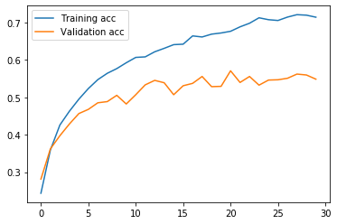{width=400}  
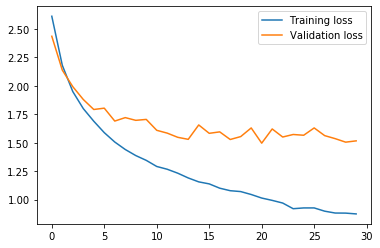{width=400}  

Hemos mejorado bastante con respecto a la solución anterior, algo más de un 10% y como veremos, también algo más de lo que mejoramos si hacemos la normlaización después de ReLU. De nuevo los valores de los pesos son diferentes debido a la modificación de las capas pero al haber ahora tanto ratio de mejora si podemos considerar este como un mejor modelo.

### 4.2.- Normalización después de ReLU

Num | Capa
----|-----
1 | Conv2D(6, kernel = 5, input = (32,32,3))
2 | Relu
new | BatchNormalization
3 | Conv2D(16, kernel = 3, padding = 'same')
4 | Relu
new | BatchNormalization
5 | MaxPooling(pool_size = 2)
6 | Conv2D(16, kernel = 3, padding = 'same')
7 | Relu
new | BatchNormalization
8 | Conv2D(24, kernel = 3, padding = 'same')
9 | Relu
new | BatchNormalization
10| Conv2D(32, kernel = 5)
11| Relu
new | BatchNormalization
12| MaxPooling(pool_size = 2)
13| Flatten()
14| Dense(100)
15| Relu
new | BatchNormalization
16| Dense(50)
17| Relu
new | BatchNormalization
18| Dense(25)
19| Softmax

\vskip 2em

```python
model_normalized = Sequential()
model_normalized.add(Conv2D(6, kernel_size=5,
				 input_shape=(32, 32,3)))
model_normalized.add(ReLU())
model_normalized.add(BatchNormalization())
model_normalized.add(Conv2D(16, kernel_size=3,
                 padding='same'))
model_normalized.add(ReLU())
model_normalized.add(BatchNormalization())
model_normalized.add(MaxPooling2D(pool_size=2))
model_normalized.add(Conv2D(16, kernel_size=3,
                 padding='same'))
model_normalized.add(ReLU())
model_normalized.add(BatchNormalization())
model_normalized.add(Conv2D(24, kernel_size=3,
                 padding='same'))
model_normalized.add(ReLU())
model_normalized.add(BatchNormalization())
model_normalized.add(Conv2D(32, kernel_size=5))
model_normalized.add(ReLU())
model_normalized.add(BatchNormalization())
model_normalized.add(MaxPooling2D(pool_size=2))
model_normalized.add(Flatten())
model_normalized.add(Dense(100))
model_normalized.add(ReLU())
model_normalized.add(BatchNormalization())
model_normalized.add(Dense(50))
model_normalized.add(ReLU())
model_normalized.add(BatchNormalization())
model_normalized.add(Dense(25, activation='softmax'))
```

Incluyendo estas capas después de la función de activación ReLU obtenemos los siguientes resultados:  

- **Optimizador:** Adam
- **Épocas:** 30
- **Batch size:** 32
- **Precisión final en test:**  0.5756  
- **Pérdida final en test:** 1.480683984565735  
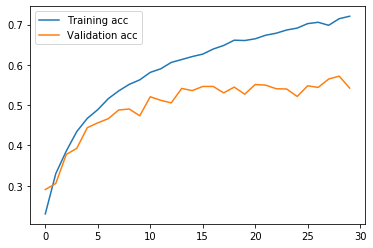{width=400}  
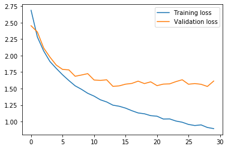{width=400}  

Hemos empeorado un poco con respecto a la solución anterior, pero no es algo muy significativo.Podría darse el caso en que con ciertos valores aleatorios de pesos obtuviésemos resultados más cercanos o incluso mejorase por poco el dato anterior.

## 5.-Early Stopping

Esta técnica consiste en cortar el entrenamiento del modelo con la intención de que no se sobreajuste demasiado a los datos de entrenamiento. Esto lo podemos hacer a fijándonos en los valores de precisión en el conjunto de validación y escoger cortar el proceso en un punto en el que la precisión no sea ni muy baja (el modelo no ha entrenado lo suficiente) ni muy alta (se ha producido overfitting); o con una función a la que podemos hacer un callback para generar una interrupción en el proceso de entrenamiento. Esta función se llama EarlyStopping y nos permite seleccionar exactamente cuándo queremos que deje de entrenar nuestro modelo.

### 5.1.- "A ojo"

Para escoger el número de épocas nos fijaremos en la ejecución del modelo anterior y teniendo como valor máximo de val_acc = 0.57 buscaremos un valor cercano (0.55) y que justamente despues de obtener este haya un empeoramiento de la precisión esto ocurre en la época 21 en el anterior apartado.

\vskip 2em

```python
historia = model_normalized.fit_generator(datagen_normalized.flow(x_train ,y_train, batch_size = batch_size, subset = 'training'),
                    validation_data = datagen_normalized.flow(x_train, y_train ,batch_size = 32,subset ='validation'),
                    epochs = 21 # épocas truncadas,
                    steps_per_epoch = len(x_train)*0.9/batch_size,
                    validation_steps = len(x_train )*0.1/batch_size)
```

Como usamos el modelo anterior si podemos restaurar los pesos y hacer una comparación estricta de los resultados.

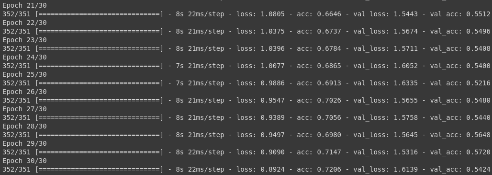{width=400}  

Tras ejecutar el modelo anterior con los mismos pesos pero parando el entrenamiento en la época 21 obtenemos estos resultados:  

- **Optimizador:** Adam
- **Épocas:** 21
- **Batch size:** 32
- **Precisión final en test:**  0.5876  
- **Pérdida final en test:** 1.3662746643066406  
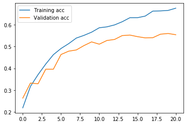{width=400}  
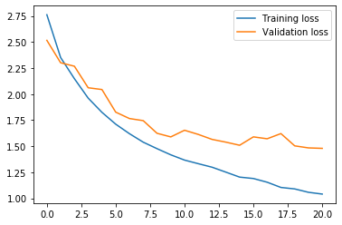{width=400}  

Puede parecer sorprendente pero hemos obtenido una mejor precisión parando el proceso de entrenamiento del modelo por lo que podemos afirmar que hemos evitado cierto overfitting.


### 5.1.- EarlyStopping
En este caso también restauramos los pesos como en el anterior y fijamos un número de épocas mayor para dar la oportunidad de que se cumplan las condiciones de parada antes de que se agote el número de épocas. Las épocas estarán fijadas a 40 pero la función EarlyStopping tendrá los siguientes parámetros: 

\vskip 2em

```python
call = [keras.callbacks.EarlyStopping(monitor='val_acc',
                                     patience=2, mode='max',
                                     restore_best_weights=True)]
```
Vamos a monitorizar el valor 'val_acc', buscamos su maximización (mode = 'max') y paramos cuando haya 2 casos de empeoramiento en val_acc.

El hecho de meter la función en una lista es mera metodología para el paso por parámtros a la función fit_generator:

\vskip 2em

```python
historia = model_normalized.fit_generator(datagen_normalized.flow(x_train ,y_train, batch_size = batch_size, subset = 'training'),
                    validation_data = datagen_normalized.flow(x_train, y_train ,batch_size = 32,subset ='validation'),
                    epochs = epochs,
                    steps_per_epoch = len(x_train)*0.9/batch_size,
                    validation_steps = len(x_train )*0.1/batch_size,
                    callbacks=call)
```

Este método nos da los siguientes valores:


- **Optimizador:** Adam
- **Épocas:** Tope: 40 ; Realizadas: 14
- **Batch size:** 32
- **Precisión final en test:**  0.5124  
- **Pérdida final en test:** 1.6317394119262696  
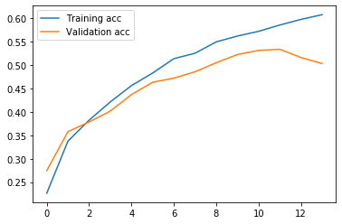{width=400}  
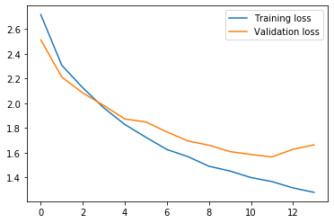{width=400}  

Como vemos ha parado demasiado pronto debido a los parámtros seleccionados. Con un buen ajuste de los mismos podríamos obtener resultados como el anterior o mejores.

# 3.- ResNET50 y Caltech-UCSD

Para resolver este aprtado vamos a usar un batch de tamaño 32 y como optimizador Adam() por las razones dadas en los primeros apartados de la práctica.

En primer lugar creamos un generador de datos usando como funcion de preprocesado de imágenes la aportada por keras _preprocessing_input_.

\vskip 2em

```python
datagen = ImageDataGenerator(preprocessing_function=preprocess_input)
```

Segudamente declaramos la red ResNet50 preentrenada con imagenet y sin la última capa para que no esté especializada en ese conjunto de imágenes.

\vskip 2em

```python
resnet50 = ResNet50(include_top = False ,weights ='imagenet', pooling ='avg')
```

Predecimos las etiquetas de los conjuntos test y train con ayuda de la ResNet que acabamos de modificar.

\vskip 2em

```python
predicted_train = resnet50.predict_generator(datagen.flow(x_train, y_train, batch_size = batch_size,
                                    shuffle = False),
                                    verbose=1)
predicted_test = resnet50.predict_generator(datagen.flow(x_test, y_test, batch_size = batch_size,
                                    shuffle = False),
                                    verbose=1)
```

Una vez hecha esta predicción creamos un modelo secuencial sencillo con las capas densas necesarias para ajustarlo al conjunto CalTech que contiene 200 clases de pájaros.

\vskip 2em

```python
modelo_dense = Sequential()
modelo_dense.add(Dense(400, activation = 'relu'))
modelo_dense.add(Dense(200, activation = 'softmax'))

modelo_dense.compile(loss=keras.losses.categorical_crossentropy,
              optimizer=optimizador,
              metrics=['accuracy'])
```

Entrenamos este nuevo modelo durante 40 épocas con las predicciones realizadas por Resnet y le indicamos un split para validación de un 10%.

\vskip 2em

```python
historia = modelo_dense.fit(predicted_train, y_train,
                    epochs = 40,
                    batch_size= 32,
                    validation_split=0.1,
                    verbose=1)
```
Una vez entrenado evaluamos el modelo conlos datos de test y obtenemos los siguientes resultados:


- **Optimizador:** Adam
- **Épocas:** 40
- **Batch size:** 32
- **Precisión final en test:**  0.4121332014703609  
- **Pérdida final en test:** 2.354458136012992  
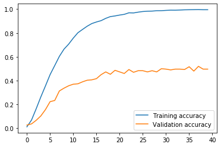{width=400}  
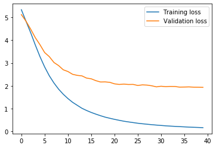{width=400}  

El resultado no es mejor que los modelos explicados anteriormente.

Si ahora incluimos las capas densas en la Resnet y entrenamos toda la red al completo con nuestro conjunto de la siguiente manera:

\vskip 2em

```python
# Añadimos las capas densas a resnet y compilamos
resnet50_2 = ResNet50(include_top = False ,weights ='imagenet', pooling ='avg')
x = resnet50_2.output
x = Dense(400, activation = 'relu')(x)
last = Dense(200, activation = 'softmax')(x)

new_model = Model(inputs = resnet50_2.input, outputs = last)
new_model.compile(loss=keras.losses.categorical_crossentropy,
              optimizer=optimizador,
              metrics=['accuracy'])
```

Definimos unos generadores de datos para el conjunto train y validation y otro para test: 

\vskip 2em

```python
datagen = ImageDataGenerator(validation_split = 0.1,
                             preprocessing_function=preprocess_input)

datagen_test = ImageDataGenerator(preprocessing_function=preprocess_input)

datagen.fit(x_train)
datagen_test.fit(x_train)
```

Por ultimo entrenamos y mostramos los resultados

\vskip 2em

```python
historia = new_model.fit_generator(datagen.flow(x_train ,y_train, batch_size = batch_size, subset='training'),
                    validation_data = datagen.flow(x_train, y_train ,batch_size = batch_size, subset='validation'),
                    epochs = 40,
                    steps_per_epoch = len(x_train)*0.9/batch_size,
                    validation_steps = len(x_train )*0.1/batch_size)

score = new_model.evaluate(datagen.flow(x_test ,y_test, verbose=1)
print('Test loss:', score[0])
print('Test accuracy:', score[1])
```

Por desgracia no he podido obtener los datos ya que, intuyo debido a un error en el código, la ejecución de cada época dura entorno a 40 minutos se me hace imposible el entrenamiento del modelo.