# Ejercicio 1
**Detección de puntos Harris. Aplicar la detección de puntos Harris sobre una pirámide Gaussiana de la imagen, presentar dichos puntos sobre las imágenes haciendo uso de la función drawKeyPoints.  Presentar los resultados con las imágenes Yosemite.rar. Para ello:**
- **Detectar los puntos Harris en cada nivel de la pirámide a partir de la información de la función cornerEigenValsAndVecs(). Por cada punto extraemos una estructura KeyPoint :(x,y, escala, orientación). Estimar la escala como blockSize\*nivel_piramide y la orientación del parche como la orientación del gradiente en su punto central tras un alisamiento de la imagen con un sigma=4.5.**
- **Variar los valores de umbral de la función de detección de puntos hasta obtener un conjunto numeroso ( > 2000) de puntos HARRIS en total que sea representativo a distintas escalas de la imagen. Justificar la elección de los parámetros en relación a la representatividad de los puntos obtenidos.**
- **Identificar cuantos puntos se han detectado dentro de cada octava. Para ello mostrar el resultado dibujando los KeyPoints con drawKeyPoints. Valorar el resultado**

Para empezar leeremos la imagen a tratar y la guardaremos como imagen a color e imagen en escala de grises. Tras esto calcularemos la pirámide Gaussiana de ambas. La pirámide de la escala de grises la utilizaremos para el cálculo de los puntos de Harris mientras que la de color tan solo será para mostrar los puntos encontrados.

\vskip 2em
```python
#Lectura de imagen
im_color, im_tr = leer_imagen(path)
# Cálculo de niveles de la pirámide Gaussiana
v_pyr = GaussianPyramid(im_tr)
v_pyr_color = GaussianPyramid(im_color)
```

Los KeyPoints se componen de (x, y, escala, orientación). En pos de calcular la orientación correspondiente a cada uno deberemos calcular el gradiente de la imagen, aplicarle un suavizado con $\sigma=4.5$ y calcular la pirámide Gaussiana para la imagen derivada en X y para la derivada en Y.

Las funciones _gradiente_, _GaussianPyramid_ y _Gaussiana2D_ son las mismas que las utilizadas en la práctica anteriror.

\vskip 2em
```python
grad_x, grad_y = gradiente(im_tr, 5)
# Aplicamos un suavizado con sigma = 4.5 a ambos gradientes
grad_x = Gaussiana2D(grad_x, 5, 4.5, cv2.BORDER_DEFAULT)
grad_y = Gaussiana2D(grad_y, 5, 4.5, cv2.BORDER_DEFAULT)
# Calculamos la pirámide Gaussiana para cada gradiente
pyr_grad_x = GaussianPyramid(grad_x)
pyr_grad_y = GaussianPyramid(grad_y)
```

Una vez ya tenemos todos los datos preparados procedemos a calcular los puntos de Harris para cada nivel de la pirámide de la imagen original.

En primer lugar obtenemos los valores y vectores de Eigen con la función _cornerEigenValsAndVecs_ de openCV. Esto nos devuelve por cada píxel de la imagen una estructura como la siguiente: $\left(\lambda_{1}, \lambda_{2}, x_{1}, y_{1}, x_{2}, y_{2}\right)$ donde $\lambda_{1}$ y $\lambda_{2}$ son los valores de Eigen y $x_{i}$ e $y_{i}$ son los vectores Eigen de su $\lambda_i$ correspondiente. Para obtener las esquinas que ha detectado esta función dividiremos el determinante de H (la matriz de Harris para la detección de bordes/esquinas) entre la traza de H.

$$f=\frac{\lambda_{1} \lambda_{2}}{\lambda_{1}+\lambda_{2}}=\frac{\text {determinant}(H)}{\operatorname{trace}(H)}$$

Esto nos deja una imagen del mismo tamaño que la imagen tratada pero en escala de grises donde todos los píxeles se muestran negros excepto aquellos que se han considerado de interés que son marcados con un nivel de blanco proporcional a éste.

En este caso _R_ es la imagen que almacena el resultado de la operación.

\vskip 2em
```python
BlockSize = 7
eigs = cv2.cornerEigenValsAndVecs(v_pyr[i], BlockSize, 7)
# Nos quedamos con el valor de las lambdas
eigs = eigs[:, :, 0:2]
Lambda1 = eigs[:, :, 0]
Lambda2 = eigs[:, :, 1]

# Calcualmos el operador Harris
R = (Lambda1 * Lambda2)/(Lambda1 + Lambda2)
```

Podemos ver los resultados que nos muestra en las dos imágenes de yosemite1 y 2.

Los mostrados a continuación son para la imagen ***Yosemite1.png*** y se muestran en orden ascentende de niveles de pirámide:

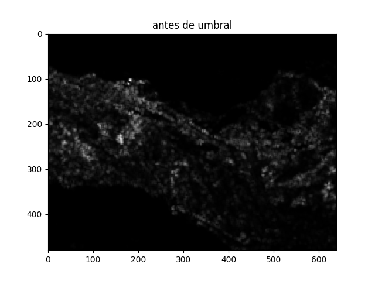
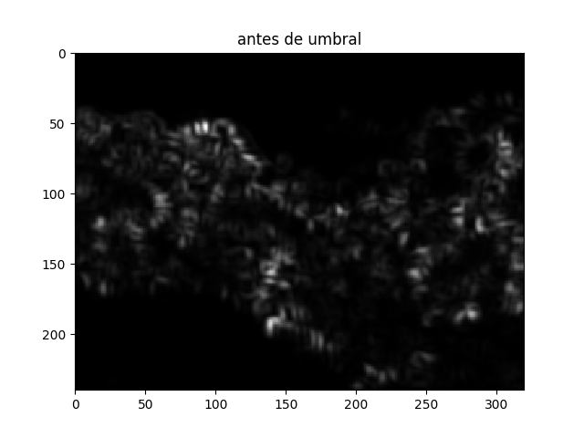
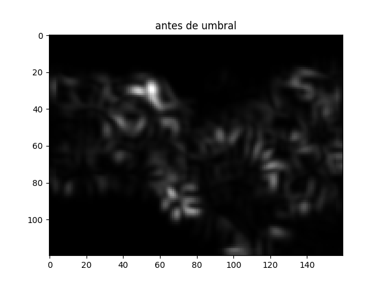
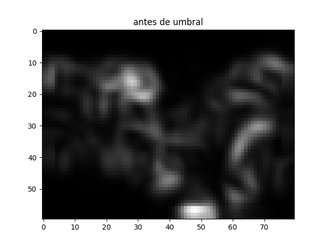
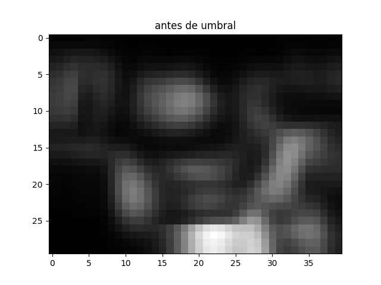

Los mostrados a continuación son para la imagen ***Yosemite2.png*** y se muestran en orden ascentende de niveles de pirámide:

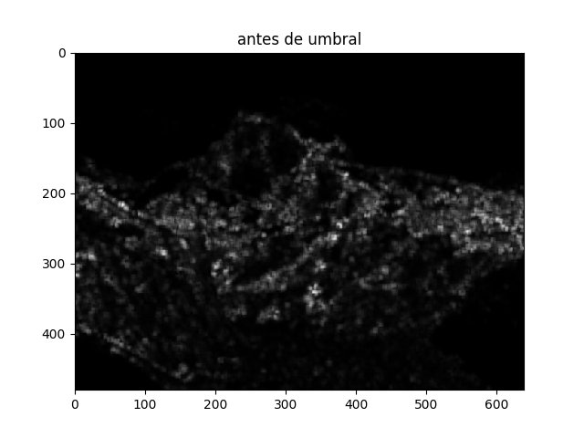
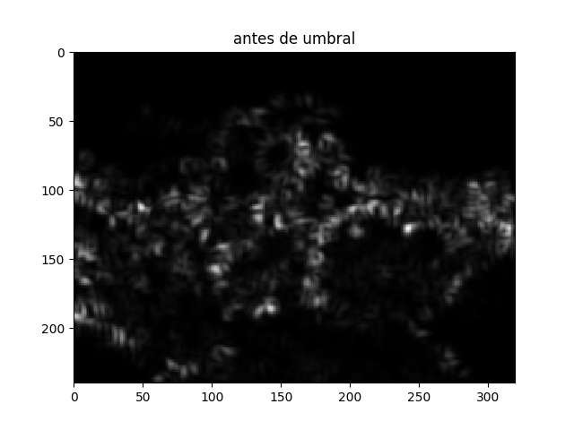
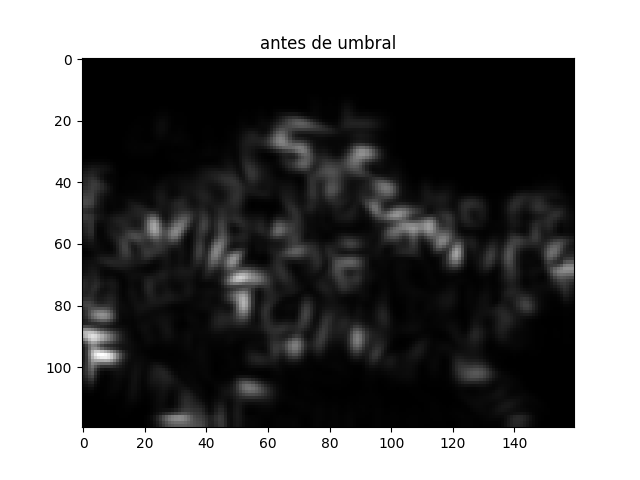
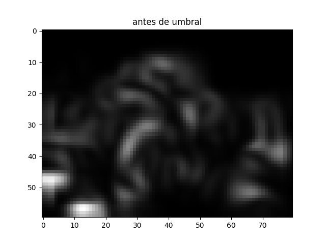
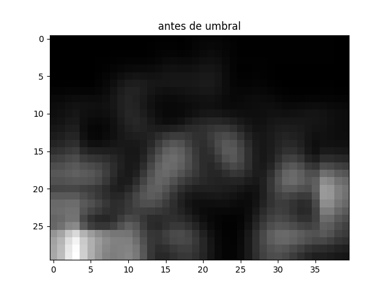

Como podemos observar tenemos una gran cantidad de puntos que realmente podríamos decir que son los más destacables de la imagen ya que nos permite visualizar perfectamente el la silueta de la imagen junto a muchos detalles. Sin embargo son demasiados puntos para ser considerados en su totalidad puntos clave por lo que debemos ajustar un umbral para decidir a partir de que intensidad nos parece un punto de interés. En mi caso he fijado un $umbral = 90$ para conseguir la marca de +2000 puntos tras aplicarlo tal y como se dice en el ejercicio. Esto junto con los valores de BlockSize y ksize (ambos valen 7) conseguimos un total de 3322 puntos en _yosemmite1_ (contando todos los niveles de la pirámide) y 4797 puntos en _yosemite2_.

_BlockSize_ marca el tamaño de vecindario en el que se buscarán puntos de interés por lo que si el tamaño es muy pequeño encuentra muy pocos puntos y si es muy grande quizás los puntos encontrados no sean tan de interés. Con un valor de 7 hemos conseguido unos buenos resultados como veremos más adelante.

_ksize_ es el tamaño del vecindario que se utiliza para aplicar Sobel y, al igual que antes, es un tamaño de vecindario que nos permite tener en cuenta una cantidad razonable de píxeles sin perder mucha información por irnos a escalas muy grandes o muy chicas.

Tras obtener estos resultados (imágenes superiores) vamos a aplicar el umbral para realizar una criba sobre estos puntos resultantes y obtener los resultados antes mencionados (3322 puntos en _yosemmite1_ y 4797 puntos en _yosemite2_.). Si los puntos no son superiores al umbral marcado los ponemos a cero.


\vskip 2em
```python
# Aplicamos el umbral
for j in range(R.shape[0]):
    for k in range(R.shape[1]):
        if(R[j][k] < umbral):
            R[j][k] = 0
```

Una vez aplicado el umbral obtenemos lo siguiente


Los mostrados a continuación son para la imagen ***Yosemite1.png*** y se muestran en orden ascentende de niveles de pirámide:

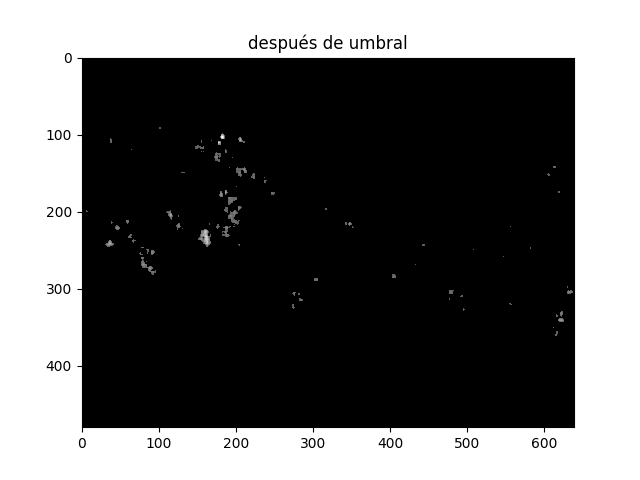
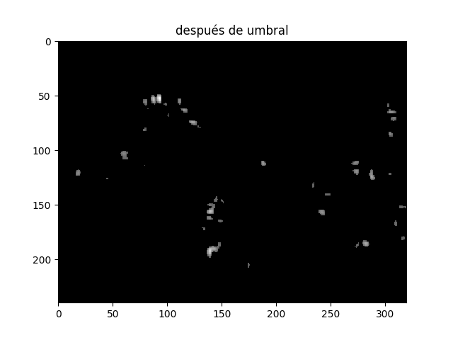
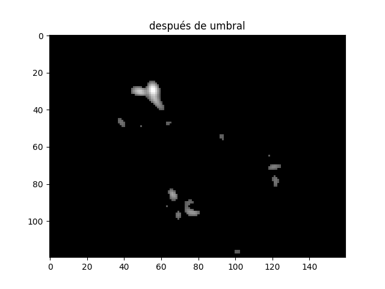
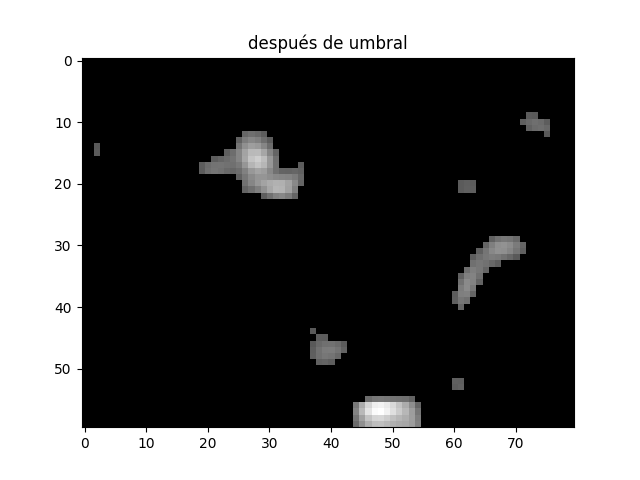
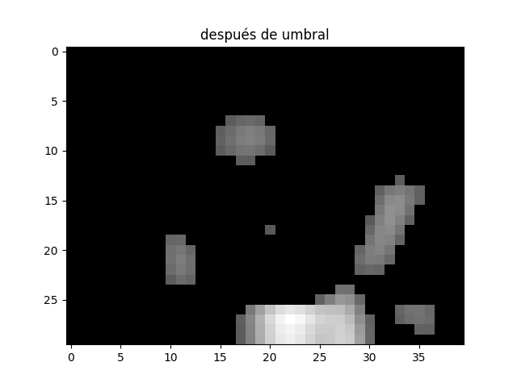

Los mostrados a continuación son para la imagen ***Yosemite2.png*** y se muestran en orden ascentende de niveles de pirámide:

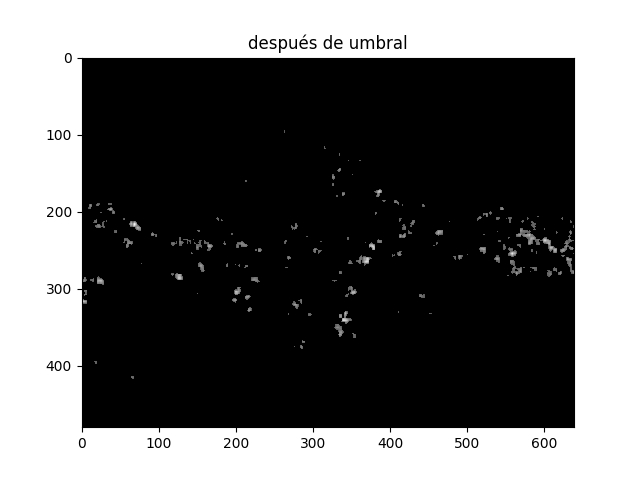
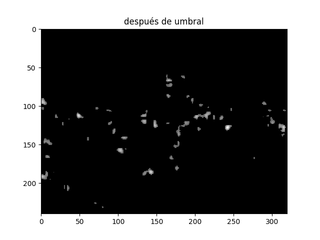
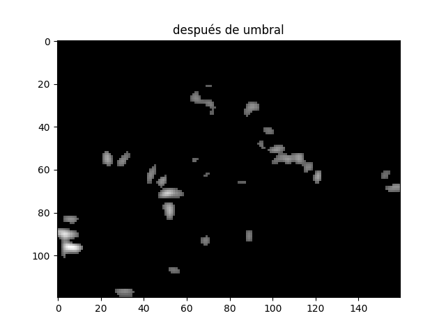
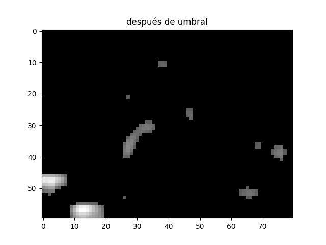
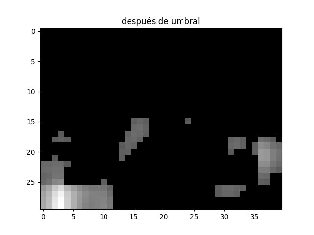

Como vemos hemos disminuido muchísimo la cantidad de puntos en cada imagen . Ahora tenemos un conjunto de puntos por octava que realmente son representativos pero podríamos ser aún más finos. Vamos a aplicar la supresión de no máximos sobre un vecindario de 3x3 para obtener el punto de mayor interés de todo el vecindario.

\vskip 2em
```python
# Realizamos la supresión de no máximos en un vecindario 3x3
no_max, level_indices = supNoMax(R)
```

Tras la supresión estos son los resultados.


Los mostrados a continuación son para la imagen ***Yosemite1.png*** y se muestran en orden ascentende de niveles de pirámide:

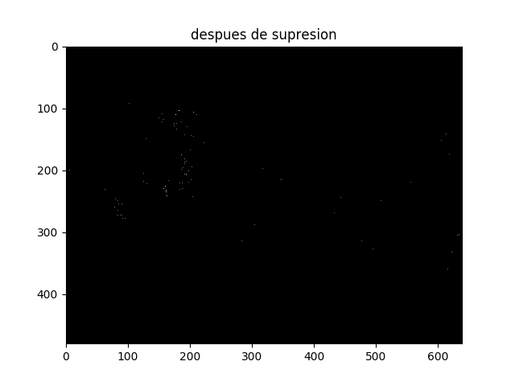
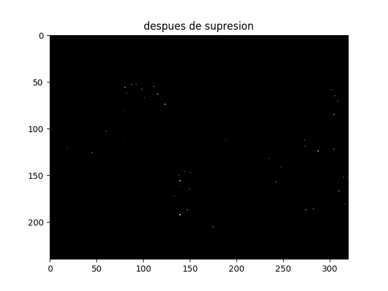
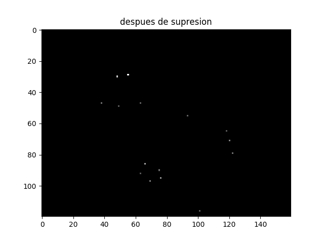
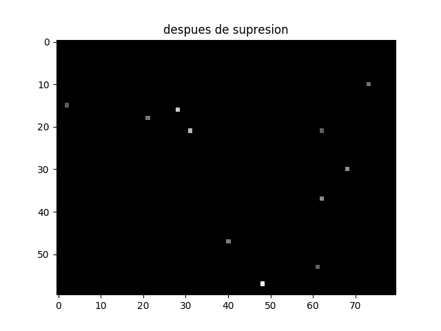
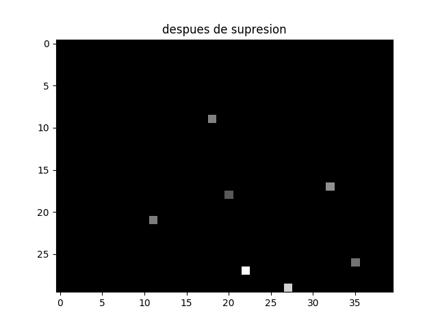

Los mostrados a continuación son para la imagen ***Yosemite2.png*** y se muestran en orden ascentende de niveles de pirámide:


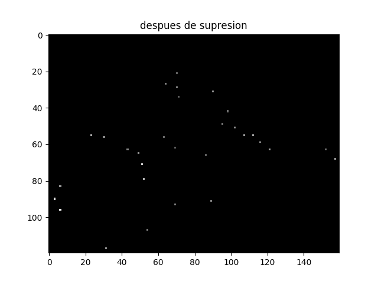

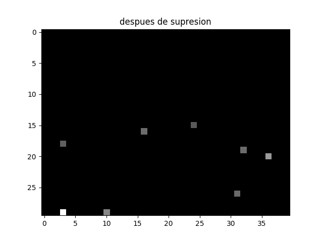

Ahora sí tenemos unos conjuntos de puntos muy precisos. En total para cada imagen tenemos:  
214 puntos para yosemite1  
395 puntos para yosemite2

Ahora que tenemos los puntos definitivos tenemos las coordenadas _x_ e _y_ de los KeyPoints. Vamos a proceder a calcular la escala y la orientación.

La escala es fácilmente calculable. Tan sólo tendremos que ultiplicar el _BlockSize_ por el nivel de la pirámide en el que nos encontremos (los niveles empezando a contar desde 1).


\vskip 2em
```python
# Escala real
# i es el nivel de la pirámide en el que nos encontramos
escala = BlockSize * (i+1)
```

La orientación o ángulo del KeyPoint (nos referiremos a partir de ahora a los KeyPoints como KP) es igual a la $\arctan(\alpha)$ siendo la $\tan(\alpha) = sin(\alpha)/cos(\alpha)$ y a su vez $[cos \theta, sen \theta] = u / |u|$, $u =(u1,u2)$, $u_1=$ gradiente en X en las coordenadas del KP, $u_2=$ gradiente en Y en las coordenadas del KP. Para verlo más fácil en código:


\vskip 2em
```python
# i es el nivel de la pirámide en el que nos encontramos
# a y b son los índices donde se encuentra el KP
# Calculamos el módulo del vector
modulo_U = np.sqrt(pyr_grad_x[i][a][b]*pyr_grad_x[i][a][b] + pyr_grad_y[i][a][b]*pyr_grad_y[i][a][b])
# Calculamos cos y sin
cos_x = pyr_grad_x[i][a][b] / modulo_U
sin_x = pyr_grad_y[i][a][b] / modulo_U
# Calculamos el ángulo (orientación del keypoint)
# El resultado en radianes comprendidos en [-pi, +pi]
# así que elo pasamos a grados
angulo = np.arctan2(cos_x, sin_x)*180/np.pi
# Si angulo es negativo lo pasamos a positivo
while(angulo < 0):
    angulo += 360
```

Ya tenemos todos los datos necesarios para conformar los KPs. Solo nos falta transformar los valores de las coordenadas obtenidos en niveles superiores de la pirámide al nivel 0 (escala original). Para ello, como hemos eliminado es cada _downsampling_ las columnas y filas pares sólo tendremos que multiplicar por la coordenada relativa $2^i$ siento _i_ el nivel de la pirámide (esta vez i sí empieza desde el nivel 0 ya que $2^0=1$). Cuando calculemos las coordenadas reales podemos construir los KPs.


\vskip 2em
```python
fila_real = np.int64(a*(2**i))
columna_real = np.int64(b*(2**i))
# Creamos el KeyPoint
kp = cv2.KeyPoint(columna_real, fila_real, escala, angulo)
# Guardamos el KeyPoint
keypoints.append(kp)
# Guardamos el KP junto a sus coordenadas relativas y el nivel donde se encuentra
kp_junto_relativas.append([i, a, b, kp])
```

Hemos guardado las coordenadas relativas y el nivel de la pirámide donde se encontro cada KP para poder representarlo más tarde. Vamos a ver que KPs hemos obtenido en cada imagen y en cada nivel de la misma.


\vskip 2em
```python
# Vamos a dibujar los Keypoints en los niveles donde fueron hallados
for i in range(len(v_pyr_color)):
    local_kp = []
    # Recorremos los keypoints junto a sus valores relativos al nivel
    for j in range(len(v_kp_junto_relativas[i])):
        # Creamos el KP con las coordenadas relativas y lo almacenamos
        n_kp = cv2.KeyPoint(v_kp_junto_relativas[i][j][2], v_kp_junto_relativas[i][j][1], v_kp_junto_relativas[i][j][3].size, v_kp_junto_relativas[i][j][3].angle)
        local_kp.append(n_kp)

    # Seleccionamos en nivel de la pirámide donde vamos a pintar
    kp_image = v_pyr_color[i]
    # Pintamos los key points
    kp_image = cv2.drawKeypoints(np.uint8(v_pyr_color[i]), local_kp, v_pyr_color[i])
    plt_imshow(kp_image)
    plt.show()

# Por último dibujamos todos los KP en el nivel 0 (imagen original)
kp_image = im_color
kp_image = cv2.drawKeypoints(np.uint8(im_color), keypoints, im_color)
plt_imshow(kp_image)
plt.show()
```


Los mostrados a continuación son para la imagen ***Yosemite1.png*** y se muestran en orden ascentende de niveles de pirámide:

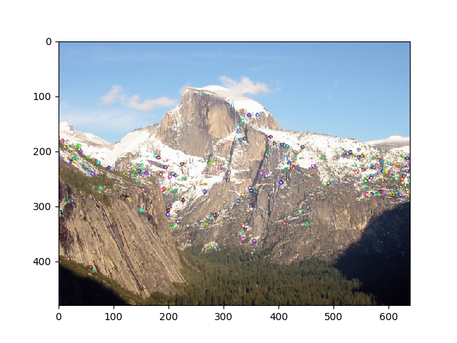


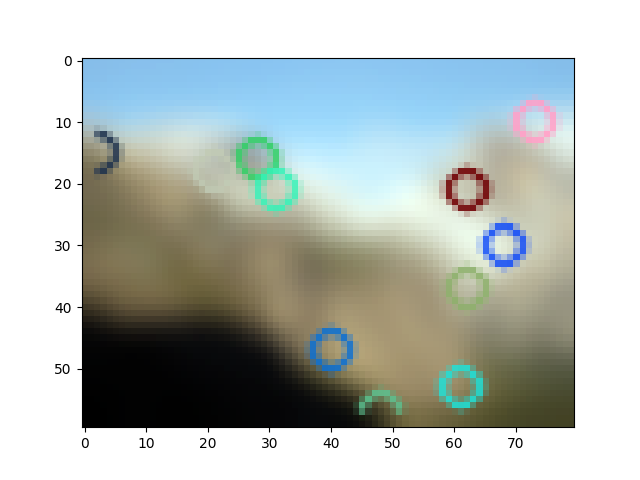
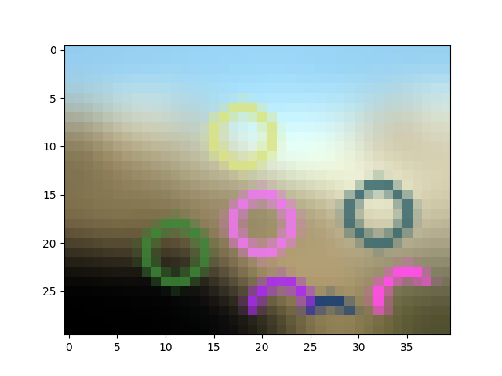

En esta imagen mostramos todos los KPs de todos los niveles en escala real:  
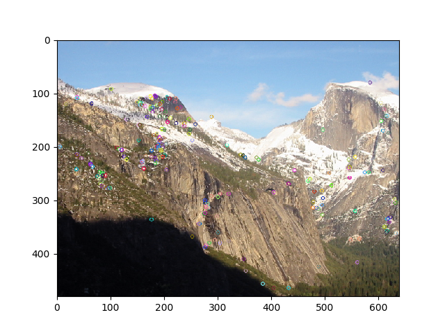

Los mostrados a continuación son para la imagen ***Yosemite2.png*** y se muestran en orden ascentende de niveles de pirámide:


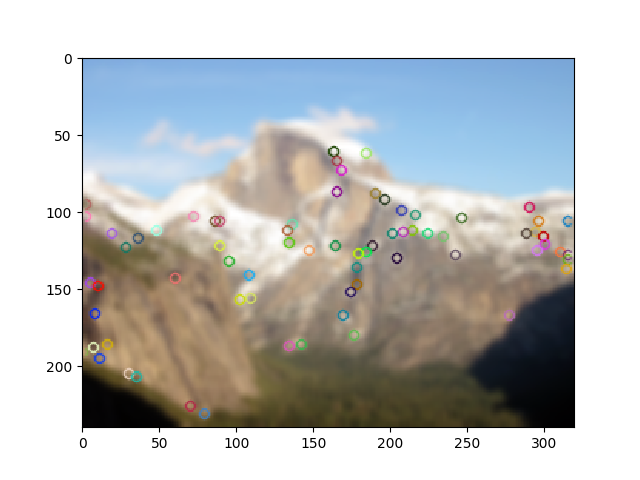
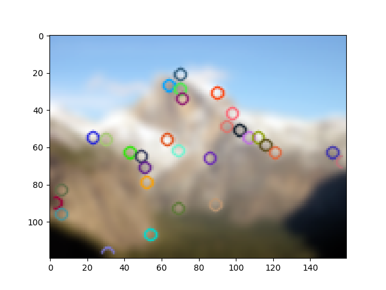
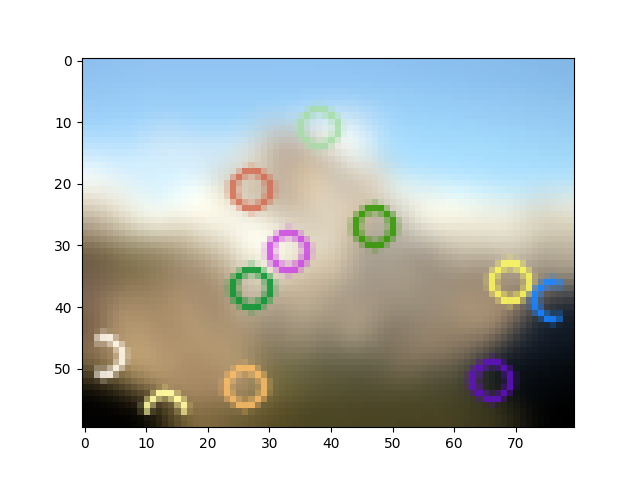
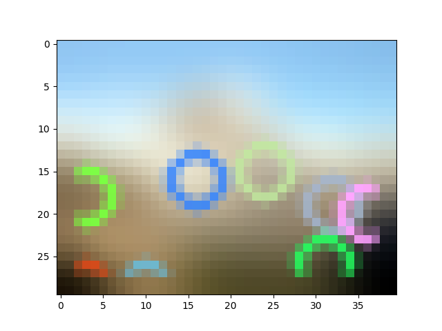

En esta imagen mostramos todos los KPs de todos los niveles en escala real:  
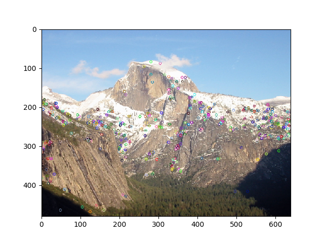

# Ejercicio 2
**Detectar y extraer los descriptores AKAZE de OpenCV, usando para ello detectAndCompute() . Establecer las correspondencias existentes entre cada dos imágenes usando el objeto BFMatcher de OpenCVy los criterios de correspondencias “BruteForce+crossCheck y “Lowe-Average-2NN”. Mostrar ambas imágenes en un mismo canvas y pintar líneas de diferentes colores entre las coordenadas de los puntos en correspondencias. Mostrar en cada caso  un máximo de 100 elegidas aleatoriamente.**
- **Valorar la calidad de los resultados obtenidos  a partir de un par de ejemplos aleatorios de 100 correspondencias.Hacerlo en términos de las correspondencias válidas observadas por inspección ocular y las tendencias de las líneas dibujadas.**

Vamos a hacer una correlación entre los KPs encontrados en las distintas imágenes del mosaico de Yosemite. Estolo vamos a hacer por parejas cosecutivas de imágenes (1-2, 2-3, 3-4, 4-5, 5-6, 6-7).

En primer lugar declararemos todos los paths de las imágnes para que su lectura sea más automatizada.


\vskip 2em
```python
# Declaramos el path de todas las imágenes
imgs = ['imagenes/yosemite1.jpg', 'imagenes/yosemite2.jpg',
        'imagenes/yosemite3.jpg', 'imagenes/yosemite4.jpg',
        'imagenes/yosemite5.jpg', 'imagenes/yosemite6.jpg',
        'imagenes/yosemite7.jpg']
```

Ahoira recorremos esta lista leyendo las imágenes de dos en dos como ya hemos dicho y obtendremos sus KPs y sus descriptores mediante el descriptor ***AKAZE*** y su función _detectAndCompute_. Para hacer esto usaremos la imagen en escala de grises.


\vskip 2em
```python
# Leemos las imgs
im_color_1, im_tr_1 = leer_imagen(imgs[i])
im_color_2, im_tr_2 = leer_imagen(imgs[i+1])

# Declaramos el descriptor
akaze = cv2.AKAZE_create()
# Calculamos los KeyPoints y los descriptores para cada imagen
kp_1, desc1 = akaze.detectAndCompute(im_tr_1, None)
kp_2, desc2 = akaze.detectAndCompute(im_tr_2, None)
```

Una vez obtenidos estos datos para cada imagen declararmeos un enlazador o _Matcher_ por fuerza bruta que nos emparejará los KPs de ambas imágenes fijándose en el KP más cercano aún sin emparejar. El atributo _crossCheck_ a _True_ nos asegura que en los enlaces o matches devueltos cada keypoint tiene una pareja correspondiente.  

Para enlazarlo con su vecino más cercano y que no sea él mismo ordenamos las listas de keypoits en los enlazamientos por la distancia en X.


\vskip 2em
```python
# Declaramos un Matcher de fuerza bruta (el más cercano)
matcher = cv2.BFMatcher(cv2.DescriptorMatcher_BRUTEFORCE, crossCheck=True)
# Realizamos el match
matches1 = matcher.match(desc1, desc2)
# Ordenamos los matches por distancia
# Se emparejan con con el más cercano que no sea el mismo
# 2NN
matches1 = sorted(matches1, key = lambda x:x.distance)
```

Una vez calculados y ordenados podemos proceder a mostrarlos por pantalla sobre la imagen. De todos los matches calculados mostraremos 50 de manera aleatoria para ver que no todos los keypoints son bien emparejados. El hecho de mostrar 50 es que es suficiente para observar buenos y malos resultados sin dificultar la visualización por haber demasiadas líneas en pantalla.

Las imágenes mostradas a continuación son del mosaico Yosemite:

Podemos ver que en su mayoría los KPs son bien enlazados y suelen aparecer por el centro de ambas imágenes. Aquellos que no son bien enlazados suelen ser KPs en zonas no comunes a ambas imágenes.

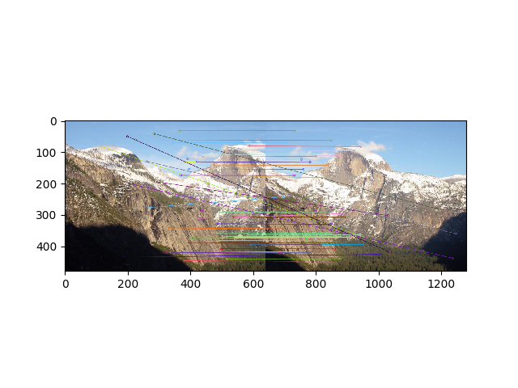
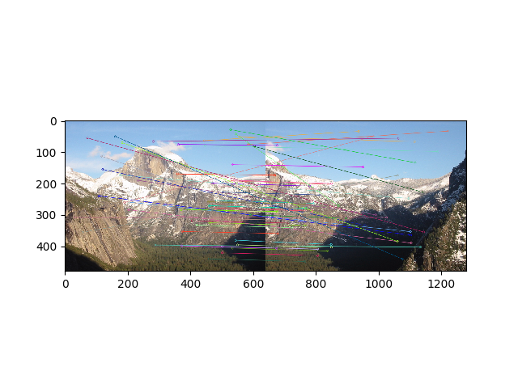

En los emparejamientos Yosemite 3-4, 4-5 y 5-6 los enlaces de KPs son muy malos ya que las imágenes casi no tienen zonas en común


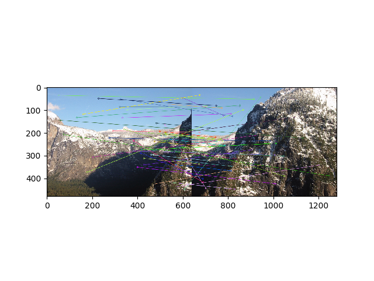
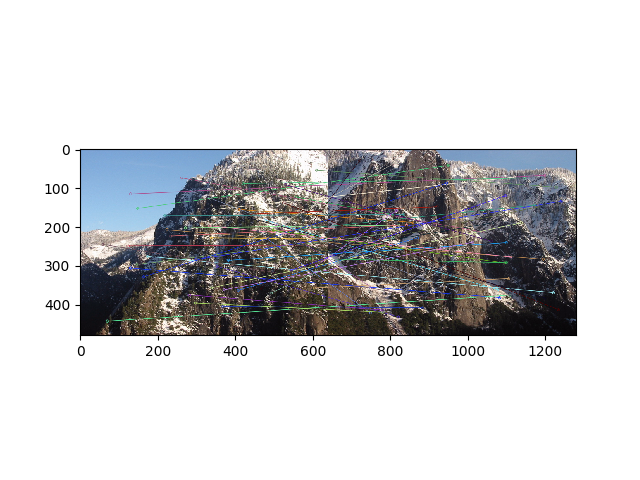
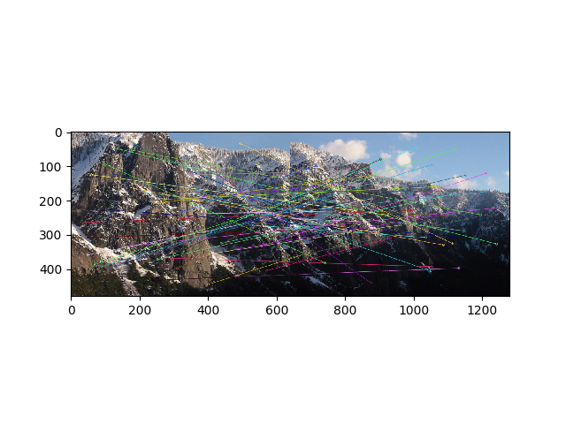

En el emparejamiento yosemite 6-7 volvemos a tener buenos resultados ya que las imágenes comparten bastante zona.


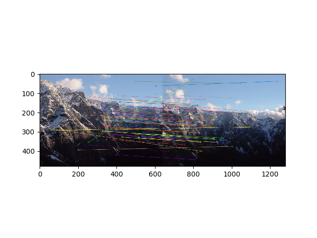

# Ejercicio 3
**Escribir una función que genere un Mosaico de calidad  a partir de N = 2 imágenes relacionadas por homografías, sus listas de keyPoints  calculados de acuerdo al punto anterior y las correspondencias encontradas entre dichas listas. Estimar las  homografías entre ellas usando la función cv2.findHomography(). Para el mosaico será necesario. a) definir una imagen enla que pintaremos el mosaico; b) definir la homografía que lleva cada una de las imágenes a la imagen del mosaico; c) usar la función cv2. warpPerspective() para trasladar cada imagen al mosaico (ayuda: mirar el  flag BORDER_TRANSPARENT de warpPerspectivepara comenzar**

De la misma manera que en el ejercicio anterior vamos a realizar enlaces entre los KPs de dos imágenes, esta vez dos imágenes de mosaico que muestran la rotonda frente la ETSIIT. Con el cálculo de los matches vamos a hacer un mosaico (superponer una imagen sobre otra de manera que parezca "una sola").


\vskip 2em
```python
im_color_src, im_gray_src = leer_imagen(path1)
im_color_dst, im_gray_dst = leer_imagen(path2)

# Declaramos el descriptor
akaze = cv2.AKAZE_create()
# Calculamos los KeyPoints y los descriptores para cada imagen
kp_src, desc1 = akaze.detectAndCompute(im_gray_src, None)
kp_dst, desc2 = akaze.detectAndCompute(im_gray_dst, None)
# Declaramos un Matcher de fuerza bruta (el más cercano)
matcher = cv2.BFMatcher(cv2.DescriptorMatcher_BRUTEFORCE, crossCheck=True)
# Realizamos el match
matches1 = matcher.match(desc1, desc2)
# Ordenamos los matches por distancia
# Se emparejan con con el más cercano que no sea el mismo
# 2NN
matches1 = sorted(matches1, key = lambda x:x.distance)
# Nos quedamos con tan solo los 30 primeros matches
# ya que son aquellos que tienen más calidad y son suficientes
# para calcular la homografía
matches1 = matches1[:30]
```

Esta vez no mezclamos los matches y nos quedamos conlos 30 mejores. 30 son suficientes para enlazar imágenes tan pequeñas como estas.

Vamos a calcular la homografía para trasladar la imagen que queremos insertar sobre otra sobre un canvas o la base del mosaico. Esta hopmografía hará coincidir las imágenes. Debemos formatear los KPs a una nueva estructura para pasárselo a la función:


\vskip 2em
```python
src_points = np.zeros((len(matches1), 2), dtype=np.float32)
dst_points = np.zeros((len(matches1), 2), dtype=np.float32)
for i, match in enumerate(matches1):
    src_points[i, :] = kp_src[match.queryIdx].pt
    dst_points[i, :] = kp_dst[match.trainIdx].pt

# Calculamos la matrix homográfica
H, mask = cv2.findHomography(src_points, dst_points, cv2.RANSAC, 5)
```

H es nuestra matriz de homografía y con la que modificaremos una imagen para hacerla encajar con la siguiente. Estolo haremos en la función _warpPerspective_.


\vskip 2em
```python
# Declaramos un tamaño para el canvas del mosaico
size = (400, 250)
# Calculamos el mosaico con warpPerspective
# Transporta la imagen a encajar al mosaico
mosaico = cv2.warpPerspective(im_color_src, H, size, borderMode=cv2.BORDER_TRANSPARENT)
# La imagen sobre la que se encaja se define en el (0,0) del mosaico
mosaico[0:im_color_dst.shape[0], 0:im_color_dst.shape[1]] = im_color_dst
```

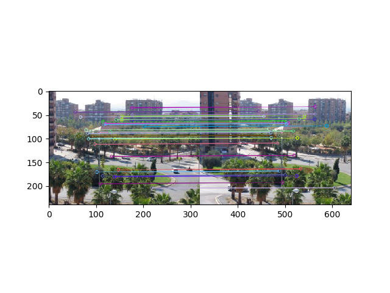
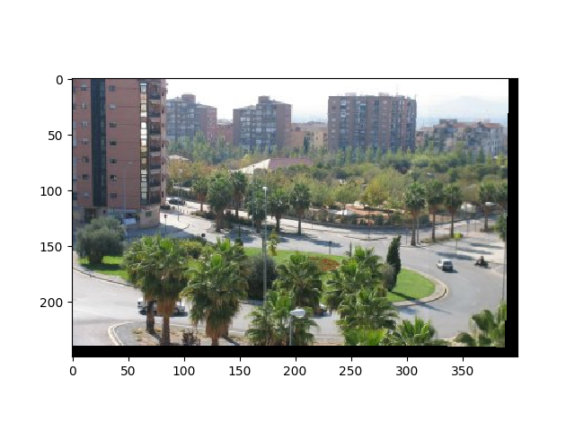

# Ejercicio 4
**Lo mismo que en el punto anterior pero usando todas las imágenes para el mosaico.**

Repetiremos lo mismo que en el ejercicio anterior pero por parejas de las imagenes del mosaico. Una vez calculamos la homografía de una imagen, la siguiente será la composición de la homografía calculada con la homografía usada anteriormente.

Parte igual al ejercicio 3 pero almacenando las homografías:

\vskip 2em
```python
# Declaranos el descriptor
akaze = cv2.AKAZE_create()
# Computamos los KeyPoints y los descriptores
kp_src, desc1 = akaze.detectAndCompute(ims_gray[i+1], None)
kp_dst, desc2 = akaze.detectAndCompute(ims_gray[i], None)
# Declaramos el Matcher
matcher = cv2.BFMatcher(cv2.DescriptorMatcher_BRUTEFORCE, crossCheck=True)
# Calculamos los matches entre imágenes
matches1 = matcher.match(desc1, desc2)
# Emparejamos cada match con su correspondiente según cercanía
matches1 = sorted(matches1, key = lambda x:x.distance)
# Nos quedamos con los 100 mejores para realizar el mosaico
matches1 = matches1[:100]

# Dibujamos en las imágenes los matches encontrados
img1 = cv2.drawMatches(np.uint8(ims_color[i+1]),kp_src,np.uint8(ims_color[i]),kp_dst,matches1[:100],None,flags=cv2.DrawMatchesFlags_NOT_DRAW_SINGLE_POINTS)
input('Mostrar matches entre imágenes')
plt_imshow(img1)
plt.show()

# Formateamos los KeyPoints para pasárselos a la homgrafía
src_points = np.zeros((len(matches1), 2), dtype=np.float32)
dst_points = np.zeros((len(matches1), 2), dtype=np.float32)
for i, match in enumerate(matches1):
    src_points[i, :] = kp_src[match.queryIdx].pt
    dst_points[i, :] = kp_dst[match.trainIdx].pt

# Calcualmos la matriz de homografía
h, mask = cv2.findHomography(src_points, dst_points, cv2.RANSAC, 5)
# La almacenamos
H.append(h)
```

PARTE DISTINTA: composición de homografías.
>current_H = current_H@H[i]


\vskip 2em
```python
# Cogemos la primera homografía
current_H = H[0]
for i in range(len(ims_color)-1):
# Si no es la primera imagen
if(i != 0):
    # Calculamos la homografía correspondiende como composición de la homografía
    # de la imagen anterior y la actual
    current_H = current_H@H[i]
    # Pintamos la imagen actual en el mosaico (canvas) según nos marca la homografía
    cv2.warpPerspective(ims_color[i+1], current_H, size, dst=mosaico, borderMode=cv2.BORDER_TRANSPARENT)
# Si es la primera imagen
else:
    # Calculamos el mosaico pintando la primera (segunda) imagen sobre él
    mosaico = cv2.warpPerspective(ims_color[i+1], current_H, size, dst=mosaico, borderMode=cv2.BORDER_TRANSPARENT)

# la primera imagen (inicial) se pinta en el (0,0) del mosaico
mosaico[0:ims_color[0].shape[0], 0:ims_color[0].shape[1]] = ims_color[0]
```

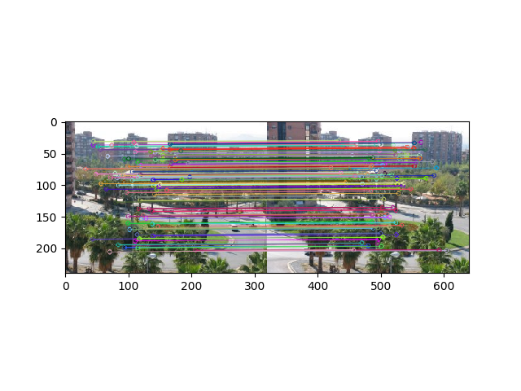
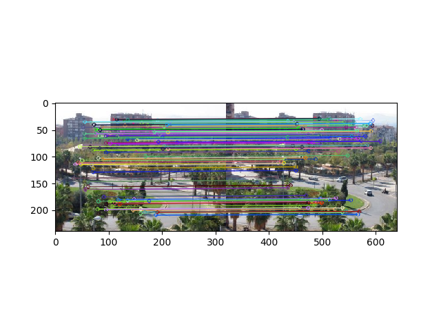
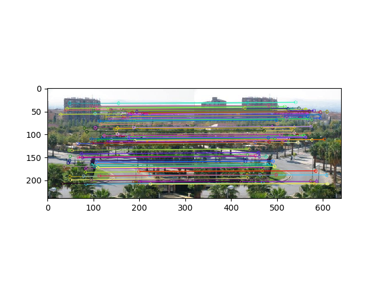
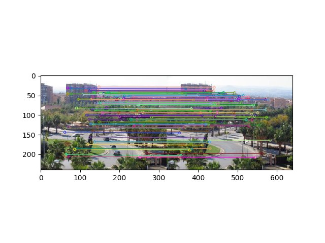
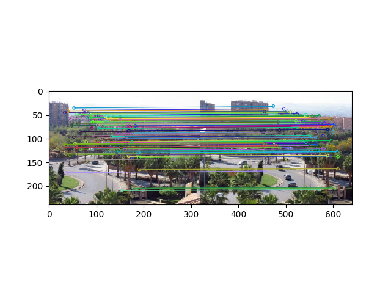
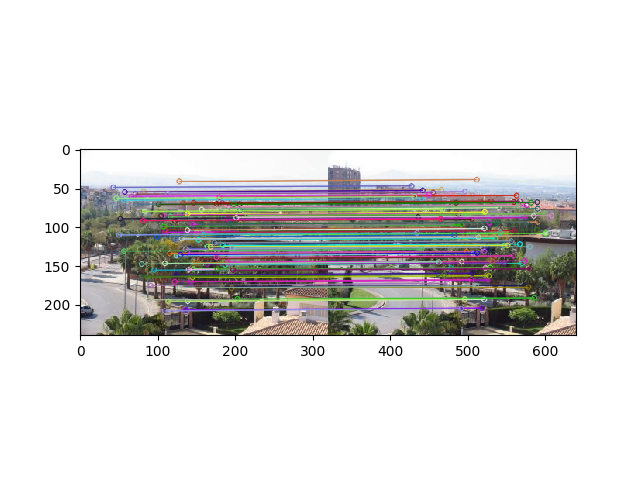
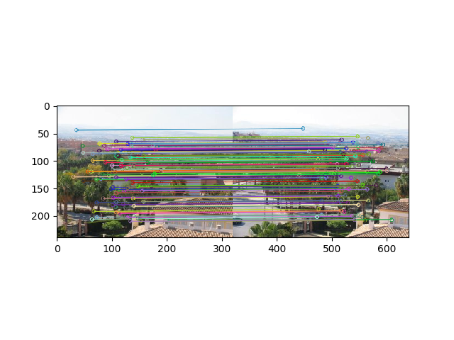
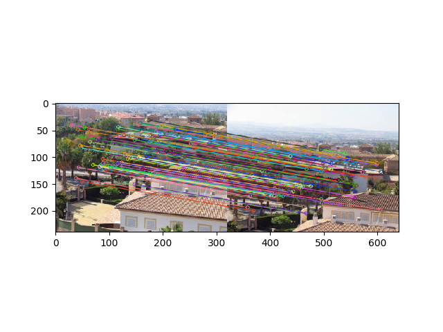
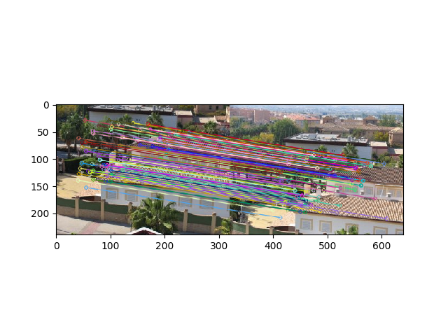
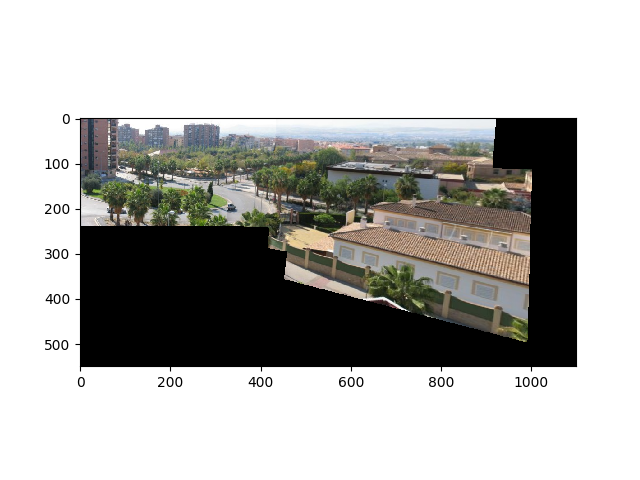