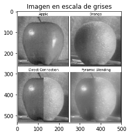
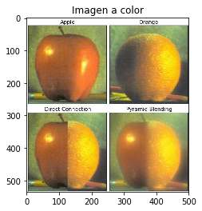
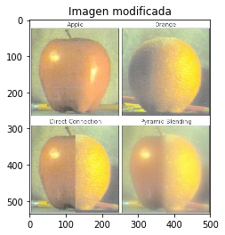
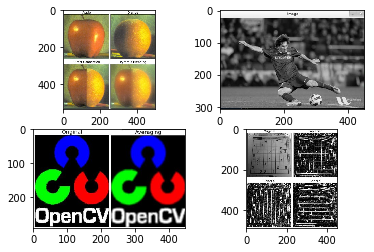
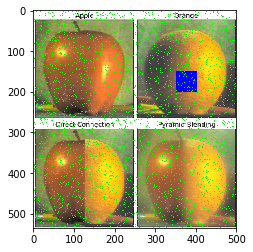
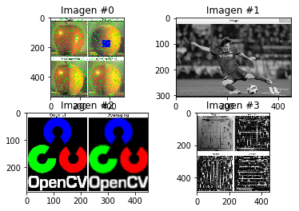

---
title: "Bonus 0"
author: [José Javier Alonso Ramos]
date: "Curso: 2019 - 2020"
subject: "Markdown"
keywords: [Markdown, Example]
subtitle: "Introducción a OpenCV y Colab"
lang: "es"
titlepage: true
titlepage-rule-height: 1
logo: "/home/jjavier/GII/logoUGR/3.png"
logo-width: 300
toc: TRUE
toc-own-page: TRUE
titlepage-color: e0fbff
titlepage-text-color: 110406
...

- **Ejecución en Google Colab**

Para ejecutar el código en Colab deberemos añadir las líneas:

\vskip 2em

```python
from google.colab import drive
drive.mount('/content/drive')
```

Además los paths hacia las imágenes los tendremos que cambiar por los paths correspondientes de drive.

- **Bibliotecas**

\vskip 2em

```python
import sys
import cv2
import matplotlib.pyplot as plt
import numpy as np
```

## EJERCICIO 1: Mostrar una imagen en escala de grises y a color.

Vamos a tomar una imagen y vamos a imprimir a la misma por pantalla tratándola como una imagen con tres canales de color (RGB o, en el caso de *opencv*, GBR) y como una imagen con tan solo un canal (escala de grises). Para poder visualizar bien cuándo estamos usando 3 canales y cuándo 1, tomaremos una imagen que originalmente es a color ya que, si escogiésemos una imagen que por defecto es es blanco y negro, se vería igual tanto con 3 canales como con 1.

- **Función para mostrar con matplotlib imágenes leídas con openCV**

Recive una imagen leída con la biblioteca *OpenCV* y la adapta al formato de *matplotlib*. Si se le pasa un título como segundo argumento lo muestra junto con la imagen, si no, no se le pondrá título.

\vskip 2em
```python
# Recive como parámetros la imagen a mostrar y el título de la misma
def plt_imshow(im, title = ''):
    # Comprobamos si la imagen tiene tres canales (BGR)
    if len(im.shape) == 3:
        # Cambiamos a RGB y mostramos
        im_plt = cv2.cvtColor(im,cv2.COLOR_BGR2RGB)
        plt.imshow(im_plt)
    # Si solo tiene 1 canal (está en escala de grises) mostramos en esa escala
    else:
        plt.imshow(im, cmap='gray')
    plt.title(title)
    plt.show()
```

- **Función para la lectura de imágenes con OpenCV**

Utilizamos *OpenCV* para leer la imagen pasada como primer argumento. Por defecto se leerá a color a no ser que se especifique otro modo de lectura como segundo argumento.

\vskip 2em
```python
# Recive como parámetros la dirección donde se encuentra la imagen y el modo de color en que será leída.
def leer_imagen(path, color = None):
    im_cv = None # Inicialización de la imagen

    # Si queremos leer la imagen en BGR
    if color == None:
        im_cv = cv2.imread(path)
        
    # Si queremos leer la imagen en otro modo
    else:
        im_cv = cv2.imread(path, color)

    # Comprobamos que hemos leído bien la imagen
    if im_cv == None:
        sys.exit('Error al leer imagen')

    # Devolvemos la imagen para cv
    return im_cv
```

- **Lectura de imágenes**

Vamos a leer una imagen a color para poder mostrarla tanto en su formato original como en escala de grises. De las imágenes de muestra aportadas vamos a tomar *orapple.jpg*. Definimos el *path* hasta ella, la leemos primero en escala de grises y después a color (con tres canales).

\vskip 2em
```python
# Directorio donde se encuentra la imagen
path = 'images/orapple.jpg'
# Lectura de la imagen en escala de grises
gris_cv = leer_imagen(path, 0)
# Lectura de la imagen a color
color_cv = leer_imagen(path)
```

- **Mostramos las imágenes**

Para mostrar las imágenes utilizamos las funciones de *matplotlib* ya que a la hora de usar *Google Colab* no da ningún problema al contrario que pasa con *OpenCV*. Además *OpenCV* presenta problemas "menores" a la hora de mostrar imágenes: la manera de cerrar la ventana generada debe ser pulsando una tecla cualquiera pero, si por casualidad cerráramos la ventana haciendo *click* en la *x*, el programa se quedaría colgado.

No obstante, encontramos el código para mostrar las imágenes con *OpenCV* comentado por si se quiere probar su funcionamiento (quitar comillas triples al principio y al final del bloque).

\vskip 2em
```python
# El código que muestra las imágenes en OpenCV está comentado
# para que el código se ejecute sin problemas en Colab
"""
# Mostramos ambas imágenes en cv2
cv2.imshow('Imagen en escala de grises', gris_cv)
cv2.imshow('Imagen a color', color_cv)

# Esperamos a la pulsación de una tecla para cerrar ambas imágenes
print('Pulse una tecla para cerrar las imágenes')
cv2.waitKey(0)
cv2.destroyAllWindows()
"""

#Mostramos ambas imágenes en plt
plt_imshow(gris_cv,'Imagen en escala de grises')
plt_imshow(color_cv,'Imagen a color')
```








## EJERCICIO 2: Mostrar una imagen monobanda y tribanda tras modificarla.

Vamos a modificar *orapple.jpg* con operaciones aritméticas para alterar los valores de los canales que tiene cada pixel de la imagen y ver cómo afecta.

- **Leemos la imagen.**

Leemos la imagen en monobanda (escala de grises) o en tribanda (RGB) a elección del usuario.

0 : Monobanda
1 : Tribanda

\vskip 2em
```python
# Directorio donde se encuentra la imagen
path = 'images/orapple.jpg'
# Seleccionamos el modo
modo = int(input('0: Monobanda\n1: Tribanda\n'))
# Inicializamos la imagen
imagen_cv = None
# Leemos la imagen
if modo:
    imagen_cv = leer_imagen(path)
else:
    imagen_cv = leer_imagen(path, modo)
```

- **Modificamos la imagen: raíz cuadrada --> disminuye intensidad**

Le aplicamos la raíz cuadrada a todos los valores de la imagen. Como resultado obtenemos la misma imagen leída pero con menor intensidad.

\vskip 2em
```python
imagen_cv = imagen_cv**(1/2)
```

- **Comprobamos el número de canales de la imagen.**

Para poder normalizar los nuevos valores obtenidos tenemos que saber cuantos canales tiene la imagen ya que debemos normalizar canal a canal.

\vskip 2em
```python
# Vemos si la imagen tiene 3 canales o solo 1
m_o_t = len(imagen_cv.shape)
color = False

# Si el tamaño es 2 la imagen está en ByN
# SI el tamaño es 3 la imagen está a color
if m_o_t == 3:
    color = True
```

- **Normalizamos la imagen**

Normalizamos los valores según la siguiente fórmula.

\vskip 2em

~~~
X_norm = (X - X_min) / (X_max - X_min)
~~~

\vskip 2em
```python
# SI es a color normalizamos cada canal por separado
if color:
    # Normalizado de la imagen
    imagen_cv[:,:,0] = (imagen_cv[:,:,0] - np.min(imagen_cv[:,:,0])) / (np.max(imagen_cv[:,:,0]) - np.min(imagen_cv[:,:,0]))*255
    imagen_cv[:,:,1] = (imagen_cv[:,:,1] - np.min(imagen_cv[:,:,1])) / (np.max(imagen_cv[:,:,1]) - np.min(imagen_cv[:,:,1]))*255
    imagen_cv[:,:,2] = (imagen_cv[:,:,2] - np.min(imagen_cv[:,:,2])) / (np.max(imagen_cv[:,:,2]) - np.min(imagen_cv[:,:,2]))*255
    
# SI es en ByN normalizamos la imagen entera (solo tiene un canal)
else:
    # Normalizado de la imagen
    imagen_cv[:,:] = (imagen_cv[:,:] - np.min(imagen_cv[:,:])) / (np.max(imagen_cv[:,:]) - np.min(imagen_cv[:,:]))*255
```

- **Pasamos la imagen a enteros sin signo y la mostramos**

Para poder mostrar la imagen tenemos que pasar los valores normalizados a enteros sin signos.

\vskip 2em
```python
imagen_cv = np.uint8(imagen_cv)

# El código que muestra las imágenes en OpenCV está comentado
# para que el código se ejecute sin problemas en Colab
"""
cv2.imshow('Imagen modificada',imagen_cv)
cv2.waitKey(0)
cv2.destroyAllWindows()
"""

plt_imshow(imagen_cv, 'Imagen modificada')
```





## EJERCICIO 3: Mostrar varias imágenes a la vez

Tenemos que mostrar varias imágenes a la vez lo que supone distintos problemas dependiendo de si hablamos de OpenCV o de Matplotlib.

En OpenCV no podemos mostrar más de una imagen por ventana por lo que tenemos que crear una imagen en la que se encuentren todas concatenadas.

En matplotlib debemos indicar el valor de cmap en caso de querer mostrar una imagen en escala de grises (un solo canal). Esto no pasa en openCV donde los canales de la imagen ya están definidos antes de mostrarla por pantalla.

- **Función que recive como argumento una lista de imágenes y las muestra con OpenCV**

La función recive como parámetro una lista de imágenes a mostrar. De estas, tomamos la anchura y el largo máximo de todas ellas. Con estas medidas formamos una plantilla de color blanco sobre la que iremos poniendo todas las imágenes originales a mostrar. De esta forma todas las imágenes tendrán las mismas dimensiones (max_largo x max_ancho) y nos será posible concaternarlas.

\vskip 2em
```python
def pintaMI_cv(vim):
    # Vamos a guardar los tamaños de las imágenes
    long_x = []
    long_y = []
    
    # Recorremos cada imagen guardando su tamaño
    for im in vim:
        long_x.append(im.shape[0])
        long_y.append(im.shape[1])
    
    # Convertimos en array
    long_x = np.asarray(long_x)
    long_y = np.asarray(long_y)
    
    # Obtenemos la longitud máxima de cada eje
    max_x = np.max(long_x)
    max_y = np.max(long_y)
    
    # Creamos una lista con las imágenes que vamos a concatenar
    imagenes = []
    
    # Recorremos el vector de imágenes pasado como parámetro
    for i in range(vim.shape[0]):
        # Inicializamos la imagen genérica
        im = None
        
        # Para las imágenes con 3 canales
        if len(vim[i].shape) == 3:
            # Creamos la imagen genérica de color blanco
            im = np.ones((max_x, max_y, 3))*255
            im = np.uint8(im)
            
            # Copiamos la imagen original sobre el fondo blanco
            for l in range(vim[i].shape[0]):
                for j in range(vim[i].shape[1]):
                    for k in range(vim[i].shape[2]):
                        im[l,j,k] = vim[i][l,j,k]
        else:
            # Creamos la imagen genérica de color blanco
            im = np.ones((max_x, max_y))*255
            im = np.uint8(im)
            
            # Copiamos la imagen original sobre el fondo blanco
            for l in range(vim[i].shape[0]):
                for j in range(vim[i].shape[1]):
                        im[l,j] = vim[i][l,j]
    
        # Guardamos la imagen sobre fondo blanco
        imagenes.append(im)

    # Concatenamos dos pares en orizontal y el resultado en vertical
    im = np.concatenate((imagenes[0], imagenes[1]), axis=1)
    im2 = np.concatenate((imagenes[2], imagenes[3]), axis=1)
    im3 = np.concatenate((im, im2), axis=0)        
        
    # Cerramos las imágenes
    cv2.imshow('',im3)
    cv2.waitKey(0)
    cv2.destroyAllWindows()
```

- **Función que recive como argumento una lista de imágenes y las muestra con Matplotlib**

Con matplotlib mostrar las imágenes juntas es más fácil ya que con la función subplot nos permite dividir una misma ventana en tantos cuadrantes como queramos y referenciar las imágenes a cada uno de ellos.

\vskip 2em
```python
def pintaMI_plt(vim):
    # Recorremos el vector
    for i in range(vim.shape[0]):
        # Subdividimos en 4 cuadrantes
        plt.subplot(2,2,i+1)
        # Mostramos cada imagen
        if len(vim[i].shape) == 3:
            im_plt = cv2.cvtColor(vim[i],cv2.COLOR_BGR2RGB)
            plt.imshow(im_plt)
        else:
            plt.imshow(vim[i], cmap='gray')
    plt.show()
```

- **Leemos las imágenes**

Leemos las cuatro imágenes de muestra para imprimirlas juntas.

\vskip 2em
```python
path1 = 'images/orapple.jpg'
path2 = 'images/messi.jpg'
path3 = 'images/logoOpenCV.jpg'
path4 = 'images/dave.jpg'

imagen_cv1 = leer_imagen(path1)
imagen_cv2 = leer_imagen(path2)
imagen_cv3 = leer_imagen(path3)
imagen_cv4 = leer_imagen(path4)
```

- **Creamos la lista de imágenes**

\vskip 2em
```python
vim_cv=[]
```

- **Insertamos las imágenes en la lista y la convertimos en vector**

\vskip 2em
```python
# Imágenes
vim_cv.append(imagen_cv1)
vim_cv.append(imagen_cv2)
vim_cv.append(imagen_cv3)
vim_cv.append(imagen_cv4)

# Transformación en vector
vim_cv = np.asarray(vim_cv)
```

- **Imprimimos las imágenes**

\vskip 2em

```python
# El código que muestra las imágenes en OpenCV está comentado
# para que el código se ejecute sin problemas en Colab

pintaMI_plt(vim_cv)
# pintaMI_cv(vim_cv)
```





Si las imágenes no son todas del mismo tipo tendremos problemas al mostrarlas con la biblioteca matplotlib ya que para cada una de ellas deberíamos especificar un valor de 'cmap' diferente. Por ejemplo: si queremos mostrar una imagen en escala de grises y las demás a color, deberíamos fijar el valor de 'cmap' a 'gray' para tan solo la imagen indicada mientras que para el resto sería el valor por defecto. Para ello podríamos comprobar en número de canales de la imagen y mostrarla según esto: 1 canal --> en escala de grises, 3 canales --> a color. Para hacerlo a gusto del usuario podríamos aceptar como parámetro una lista de duplas <imagen, cmap> para mostrarlo adecuadamente.

En cambio, en OpenCV nos encontramos el problema de que solo podemos mostrar una imagen por ventana, de modo que debemos crear una sola imagen que contenga a las demás para poder mostrarlas todas juntas, es decir, debemos concatenarlas. Para ello todas las imágenes deben tener el mismo tamaño. En vez de redimensionar la matriz original de la imagen (lo cual la deforma y la deja irreconocible) he optado por calcular el eje X e Y más largo de todas las imágenes y crear una imagen genérica blanca de manera que cualquier imagen original es igual o menor que ella. A continuación copiaremos una a una las imágenes pasadas como parámetro encima de una imagen genérica teniendo como resultado 4 imágenes del mismo tamaño que muestran las originales sobre fondo blanco. Estas nuevas imágenes sí se pueden concatenar y mostrar con OpenCV.

## EJETCICIO 4: Modificar el color de una lista de píxeles de una imagen.

- **Función para cambiar de color un pixel**

\vskip 2em
```python
# Pasamos la imagen a modificar, la posición del píxel, y el color a poner.
def color_change(im, fil, col, r, g, b):
    color = np.array([b,g,r])
    if len(im.shape) == 3:
        im[fil, col] = color
```

- **Función para cambiar el color de una lista de píxeles**

\vskip 2em
```python
# Pasamos la imagen a modificar, la lista de píxeles, y el color a poner.
def v_color_change(im, lista, r, g, b):
    color = np.array([b,g,r])
    if len(im.shape) == 3:
        for p in lista:
            im[p[0], p[1]] = color
```

- **Creamos una lista de 20.000 píxeles aleatorios que cambiaremos de color**

\vskip 2em
```python
# Creamos una lista de píxeles aleatorios
lista = []
for i in range(20000):
    # 535 y 500 son las dimensiones de orapple.jpg
    a = np.random.randint(0, 535)
    b = np.random.randint(0, 500)
    c = [a,b]
    lista.append(c)

```

- **Coloreamos un cuadrado en la imagen**

\vskip 2em
```python
# La imagen 'imagen_cv1' es orapple.jpg que ya ha sido leida en el ejercicio 3.

# Vamos a colorear de azul un cuadrado de la imagen
for i in range(150,201):
    for j in range(350,401):
        color_change(imagen_cv1, i, j, 0,0,255)

# La lista de píxeles aleatorios la colorearemos de verde
v_color_change(imagen_cv1, lista, 0,255,0)
```

- **Imprimimos por pantalla**

\vskip 2em
```python
# Mostramos la imagen modificada
plt_imshow(imagen_cv1)
```





## EJERCICIO 5: Múltiples imágenes en una misma ventana con títulos individuales

Como hemos dicho en el ejercicio 3, OpenCV solo puede mostrar una imagen por ventana y por tanto un sólo título.
Con matplotlib si podemos asignar títulos individuales a cada subplot.

- **Función para imprimir imágenes con títulos individuales**

Esta función es igual que la mostrada en el ejercicio 3 con la diferencia de asignar títulos a las imágenes. Les asigna títulos genéricos a no ser que le pasemos una lista de títulos.

\vskip 2em
```python
def title_pintaMI_plt(vim, titles = None):
    # Recorremos el vector
    for i in range(vim.shape[0]):
        plt.subplot(2,2,i+1)
        if titles == None:
            plt.title('Imagen #'+str(i))
        else:
            plt.title(titles[i])
        # Mostramos cada imagen
        if len(vim[i].shape) == 3:
            im_plt = cv2.cvtColor(vim[i],cv2.COLOR_BGR2RGB)
            plt.imshow(im_plt)
        else:
            plt.imshow(vim[i], cmap='gray')
    plt.show()
```

- **Mostramos por pantalla**

\vskip 2em
```python
title_pintaMI_plt(vim_cv)
```



