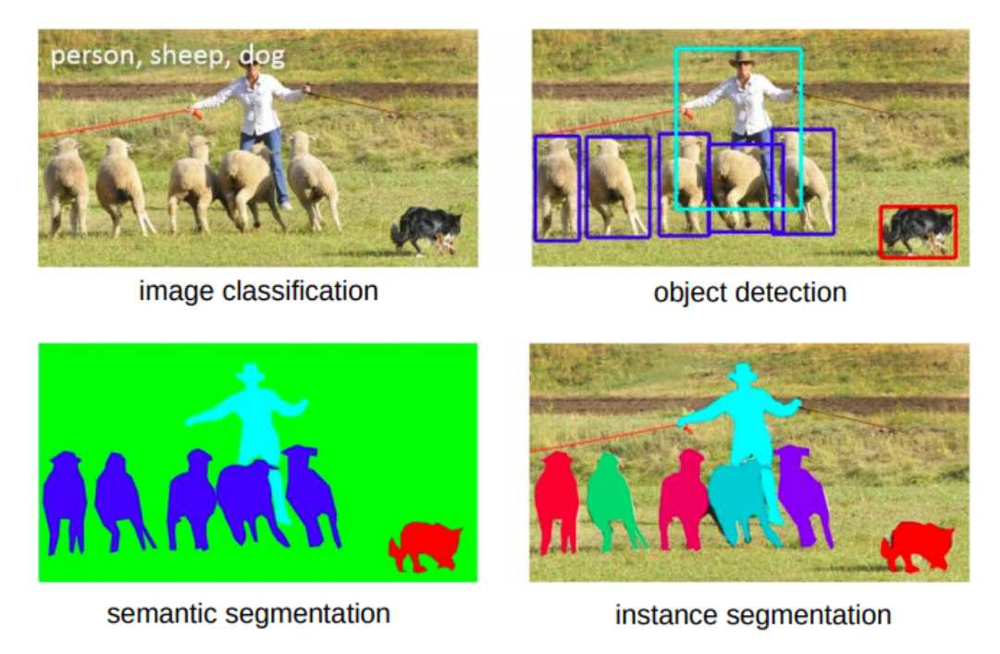
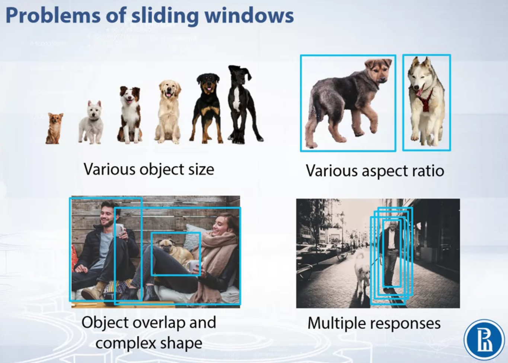
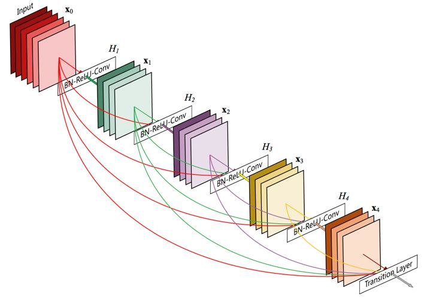
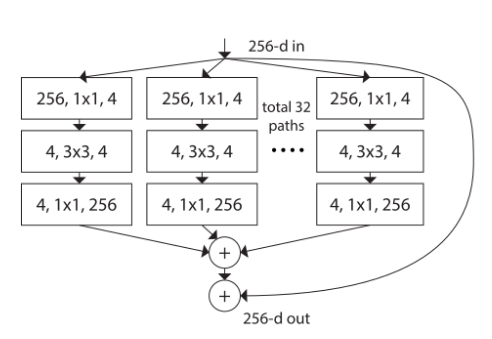
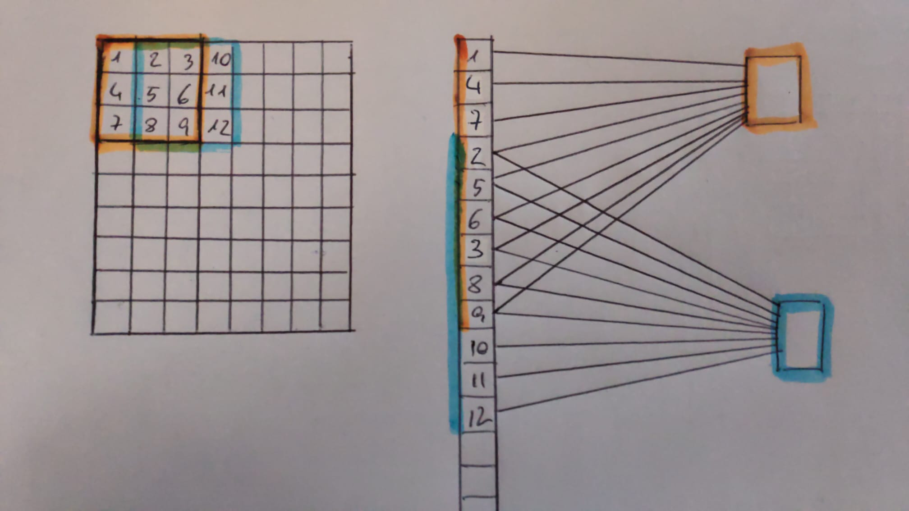
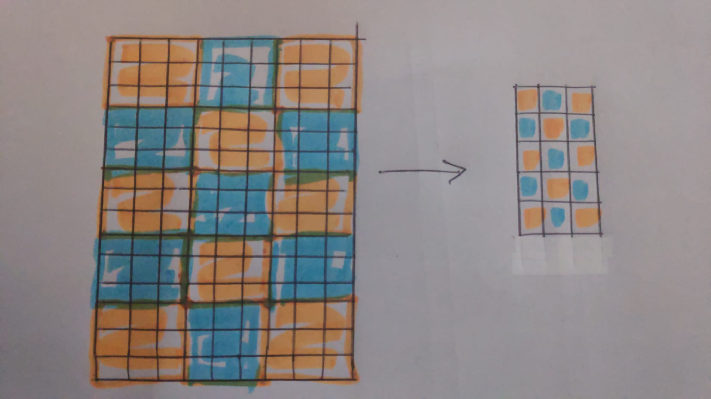

---
title: "Cuestinario 2"
author: [José Javier Alonso Ramos]
date: "Curso: 2019 - 2020"
subject: "Markdown"
keywords: [Markdown, Example]
subtitle: "TEORÍA"
lang: "es"
titlepage: true
titlepage-rule-height: 1
logo: "/home/jjavier/GII/logoUGR/3.png"
logo-width: 300
toc: TRUE
toc-depth: 10
toc-own-page: TRUE
titlepage-color: e0fbff
titlepage-text-color: 110406
...

# Ejercicio 1
**Identifique las semejanzas y diferencias entre los problemas de:**  

- a) clasificación de imágenes.
- b) detección de objetos.
- c) segmentación de imágenes.
- d) segmentación de instancias.
 
Lo que tienen en común es que en todos los problemas se realizan clasificaciones. Podríamos definir estos problemas como unas clasificaciones en orden descendente de abstracción.   
$$
Clasificación\ de\ imágenes\ >\ Detección\ de\ objetos\ > \\
segmentación\ de\ imágenes\ >\ segmentación\ de\ instancias
$$

Para explicar esto vamos a basarnos en la siguiente imagen.  

En el problema de clasificación de imágenes clasificamos según la composición general de la imagen, mientras que en la detección de objetos se clasifican regiones rectangulares (bounding  boxes) dentro de la imagen como instancias individuales que existen dentro de la misma y las localiza espacialmente.  

En segmentación de imágenes clasificamos cada pixel de la imagen con precisión y no una zona rectangular; y la segmentación de instancias no solo designa una clase a cada pixel, sino que también designa una instancia concreta de esa clase en la imagen. Viendo la imagen anterior, cada oveja tiene un color diferente indicando que son instancias diferentes, aunque realmente pertenezcan a la misma clase. 
 
# Ejercicio 2
**¿Cuál es la técnica de búsqueda estándar para la detección de objetos en una imagen? Identifique pros y contras de la misma e indique posibles soluciones para estos últimos.**
 
La ventana deslizante es el método de búsqueda estándar para la detección de objetos en imágenes.
 
Ventajas:
 
- Algoritmo bastante simple y que realiza una búsqueda exhaustiva sobre la posición y la escala.
 
Desventajas:  

 
- ***Various object size***: Los objetos pueden aparecer con tamaños distintos en la imagen. **Solución**: Variar la escala de la ventana o variar la de la imagen mediante pirámides.
- ***Various aspect ratio***: Objetos de la misma clase pueden presentarse en la imagen desde distintas perspectivas haciendo que el tamaño de ventana no se ajuste a todos los casos. **Solución**: usar varias ventanas de distinto tamaño (distinta relación de aspecto).
- ***Object overlap and complex shape***: Los objetos de una imagen se superponen creando formas incompletas o parciales de los objetos de la clase a la que pertenecen. **Solución**: Entrenar a nuestro clasificador con secciones del objeto a clasificar. El clasificador debe ser muy potente para poder discernir bien objetos superpuestos y no dar falsos positivos.
- ***Multiple responses***: Al recorrer la imagen con la ventana deslizante (con igual o distinto tamaño cada vez) podemos obtener múltiples respuestas de fuerza variable, es decir, detectamos el objeto en diferentes lugares de la imagen (lugares muy próximos entre sí). **Solución**: para obtener la detección idónea usamos la técnica de supresión de no máximos para librarnos de las detecciones menos precisas.

 
# Ejercicio 3
**Considere la aproximación que extrae una serie de características en cada píxel de la imagen para decidir si hay contorno o no. Diga si existe algún paralelismo entre la forma de actuar de esta técnica y el algoritmo de Canny. En caso positivo identifique cuales son los elementos comunes y en qué se diferencian los distintos.**

[Selective search](https://www.learnopencv.com/selective-search-for-object-detection-cpp-python/) no encuentro ningún paralelismo con Canny.
 
 
 
 
 
# Ejercicio 4
**Tanto el descriptor de SIFT como HOG usan el mismo tipo de información de la imagen pero en contextos distintos. Diga en qué se parecen y en que son distintos estos descriptores. Explique para qué es útil cada uno de ellos.**

Semejanzas:  

- Ambos descriptores se basan en gradientes de primer orden (realizan histograma de gradientes).

Diferencias:  

- El histograma de gradientes es todo lo que hace HoG mientras que para SIFT es solo el primer paso del algoritmo.
- SIFT utiliza (normalmente y según lo definió su creador, David Lowe) una ventana de 16x16 que luego subdivide en ventanas de 4x4 en las que aplica HoG sobre los puntos de interés obtenidos por medio de DoG. En cambio HoG se aplica a toda la imagen.
- SIFT es invariante ante la escala, rotación o traslación de la imagen propiedad que HoG no cumple.

SIFT más útil para la detección de objetos en una imagen. Describe la importancia en un solo punto debido al uso de la Gaussiana (DoG) y HoG es más adecuado usarlo en la clasificación de imágenes.

# Ejercicio 5
**Observando el funcionamiento global de una CNN, identifique qué dos procesos fundamentales definen lo que se realiza en un pase hacia delante de una imagen por la red. Asocie las capas que conozca a cada uno de ellos.**
 
1. Extracción de características: forman parte de este proceso las capas convolucionales, capas de pooling, funciones activación (como relu), regularización (dropout o batch normalization).
 
2. Predicción: se utilizan capas fully connected como clasificadores, cada una seguida de una función de activación, salvo la última que deberá utilizar la activación softmax como salida de nuestra red para obtener las probabilidades de cada clase.
 
 
 
# Ejercicio 6
 
**Se ha visto que el aumento de la profundidad de una CNN es un factor muy relevante para la extracción de características en problemas complejos, sin embargo este enfoque añade nuevos problemas. Identifique cuales son y qué soluciones conoce para superarlos.**

Cuanto mayor profundidad tiene una red neuronal más propensa es al overfitting. Esto lo podemos intentar solventar de diferentes maneras: podemos incluir capas de normalización como Dropout o BatchNormalization, o incrementar el número de imágenes de entrenamiento aportadas a la red. Esto último puede ser complicado así que podemos optar por incorporar data augmentation para conseguir un resultado similar.

Otro problema se da en backpropagation ya que a medida que retrocedemos en las capas el gradiente va perdiendo precisión. Para solventar la falta de información podemos incorporar módulos residuales como hace ResNet. En el lugar de incorporación de estos módulos la red se bifurca. La salida de la capa anterior se conecta a la siguiente capa y al módulo residual, a la vez que la salida del módulo se conecta a la misma capa que se conectó la anterior. También podemos hacer la red más densa tal y como lo hace el modelo DenseNet de modo que cada capa aporta información a todas las capas inferiores a ella. Otra solución es la que implementa GoogleNet que es la incorporación de clasificadores intermedios que aportan información de clasificación (precisión y fallo) en mitad de la red.

 
 
# Ejercicio 7
**Existe actualmente alternativas de interés al aumento de la profundidad para el diseño de CNN. En caso afirmativo diga cuál/es y como son.**
 
Módulos residuales.
GoogleNet
 
Ante la negativa de poder aumentar la profundidad de una red existe la posibilidad de aumentar su densidad o número de conexiones entre capas. DenseNet es un modelo de CNN que aplica este concepto. Las redes densas conectan una capa con todas las demás capas que la suceden.

Otra opción es incluir módulos residuales "en paralelo" como lo hace ResNet. Inserta módulos convolucionales entre las capas de la red esto en un principio puede parecer que incrementa la profundidad de la misma, pero nos podemos ahorrar niveles/capas de la red si insertamos más de un módulo en la misma capa (variante ResNetXt).

GoogLeNet o Inception es otra alternativa. En esta introducimos clasificadores en las capas intermedias de la red con la intención de que devuelvan por backpropagation información sobre el resultado de esta clasificación con los pesos actuales. GoogLeNet ya es de por sí una red considerablemente profunda pero si no tuviera estos clasificadores intermedios lo sería aún más. También es verdad que para incorporar estos clasificadores la red debe ser mínimamnete profunda pero como decimos, de esta manera podemos evitar hacerla más profunda aún.

También podemos optar por algo "más sencillo": extraer más características. Aumentar el número de neuronas y por consiguiente la profundidad del tensor.

 
# Ejercicio 8
**Considere una aproximación clásica al reconocimiento de escenas en donde extraemos de la imagen  un vector de características y lo usamos para decidir la clase de cada imagen. Compare este procedimiento con el uso de una CNN para el mismo problema. ¿Hay conexión entre ambas aproximaciones? En caso afirmativo indique en que parecen y en que son distintas.**  

Semejanzas:  

El pipeline es el mismo en ambos casos:  
Imagen de entrada $\rightarrow$ Preprocesado  $\rightarrow$ Extracción de carcterísticas $\rightarrow$ Clasificación  

Diferencias:  

- **Aproximación clásica**: la extracción de características en los descriptores como SIFT, SURF, BRIEF, etc. la hacía un ingeniero basándose en conocimiento. La única implementación de Machine Learning es el  clasificador, por ejemplo SVM. El proceso es eficiente y muy transparente ('hardcoded')pero es menos eficaz que la implementación por CNN. Son algoritmos muy generales y funcionan de la misma manera para diferentes imágenes.  
- **CNN**: Se intriduce el concepto end-to-end, el cuál se refiere al automatismo de todo el proceso tanto de extracción de características como la clasificación de las imágenes. La computación del proceso es más larga y pesada pero obtiene mejores resultados. La red puede tener overfitting y no  comportarse adecuadamente con imágenes fuera del training set.  
 

 
 
# Ejercicio 9
**¿Cómo evoluciona el campo receptivo de las neuronas de una CNN con la profundidad de la capas? ¿Se solapan los campos receptivos de las distintas neuronas de una misma profundidad? ¿Es este hecho algo positivo o negativo de cara a un mejor funcionamiento?**

El campo receptivo aumenta a medida que nos adentramos en la profundidad de la red. En las capas más superficiales el campo receptivo es menor que en las capas más profundas.
En la primera capa de la red coincide el número de neuronas con el número de celdas de la imagen si esta es en blanco y negro, o con el triple si es a color. Si posteriormente aplicamos una convolución 3x3, las neuronas de la siguiente capa son influidas por las 9 celdas a las que afecta el filtro de convolución. Como suponemos que no hay stride, el filtro se mueve una celda en vertical u horizontal y vuelve a aplicarse. Esto nos deja con 6 celdas comunes con la aplicación anterior, es decir, el campo efectivo de dos neuronas diferentes de una misma capa se solapa.  
Una vez creada la nueva capa, aplicamos otra convolución 3x3 por lo que las neuronas de la nueva capa serán influidas por 9 celdas/neuronas de la capa anterior que a su vez eran influidas por 9 de la anterior. Con esto tenemos que el campo receptivo de la segunda capa convolucional es bastante mayor que el de la primera.

Podemos evitar el solapamiento de una capa a otra aplicando un stride igual a la anchura/altura del filtro siempre y cuando este sea cuadrado. Por ejemplo:  
Si el filtro es 3x3 y aplicamos un stride de 3 desplazaremos el filtro tres celdas antes de volver a aplicarlo por lo que las celdas que entran en juego cada vez que se aplica el filtro son distintas.

El solapamiento es algo bueno ya que permite establecer una relación entre las celdas vecinas. Esta relación es más fuerte (el solapamiento es más frecuente) cuando las celdas son contiguas y más débil (solapamiento entra en juego menos veces) en celdas distantes. La información de una imagen viene representada por el orden en que se colocan sus píxeles por lo que es importante que la red aprenda este orden o secuencia de píxeles/celdas ya que determina la relación entre ellas.
 
 
# Ejercicio 10
**¿Qué operación es central en el proceso de aprendizaje y optimización de una CNN?**
 
La principal operación es la convolución ya que es la que permite a la red neuronal trabajar con imágenes y extraer de ellas las características que nos interesa aprender. Además es lo que diferencia a una CNN de una NN convencional.
 
 
# Ejercicio 11
**Compare los modelos de detección de objetos basados en aproximaciones clásicas y los basados en CNN y diga que dos procesos comunes a ambos aproximaciones han sido muy mejorados en los modelos CNN. Indique cómo.**  
 
En detección de objetos tanto la clasificación de estos objetos como la obtención del bounding box para posicionarlo en la imagen han sido mejoradas en las CNN con respecto a las aproximaciones clásicas.

El bounding box en los métodos tradicionales o se precalculaba o se establecía según el tamaño de la ventana deslizante que localizara el objeto. En las CNN, el tamaño del bounding box es calculado por regresión con L2 como función de pérdida consiguiendo ser mucho más preciso.

La clasificación es mucho más exacta debido a que la extracción de características es aprendida y no establecida a mano como en los modelos clásicos. Además ahora contamos con bases de datos de imágenes enormes que permiten un proceso de aprendizaje muy óptimo.
 
# Ejercicio 12
**Es posible construir arquitecturas CNN que sean independientes de las dimensiones de la imagen de entrada. En caso afirmativo diga cómo hacerlo y cómo interpretar la salida.**

La manera más simple de "obviar" el tamaño de entrada sería introducir un preprocesamiento de cada imagen antes de introducirlas en la red aplicando un reescalado a unas dimensiones concretas aceptadas por la red. La desventaja es que esto acarrea una pérdida de información tanto por upsampling como por downsampling, por lo que el aprendizaje de la red puede no ser adecuado y por tanto la precisión de la misma puede que no cumpla con los requisitos que se esperaba que cumpliese.

Otra opción son las Redes Totalmente Convolucionales, las cuales no cuentan con capas totalmente conectadas al final de su estructura por lo que las dimensiones de la salida dependen de las dimensiones de entrada; no hay una prefijada.

 
# Ejercicio 13
**Suponga que entrenamos una arquitectura Lenet-5 para clasificar imágenes 128x128 de 5 clases distintas. Diga qué cambios deberían de hacerse en la arquitectura del modelo para que sea capaz de detectar las zonas de la imagen donde aparecen alguno de los objetos con los que fue entrenada.**  
 
Convertirla en una R-CNN.
 
 
 
# Ejercicio 14
**Argumente por qué la transformación de un tensor de dimensiones 128x32x32 en otro de dimensiones 256x16x16, usando una convolución 3x3 con stride=2, tiene sentido que pueda ser aproximada por una secuencia de tres convoluciones: convolución 1x1 + convolución 3x3 + convolución 1x1. Diga también qué papel juegan cada una de las tres convoluciones.**
 
Tiene sentido realizarlo en tres pasos ya que las convoluciones 1x1 solo afectan a la cantidad de filtros calculados lo que deriva en que afecta al número de operaciones que se realizan en sucesivas convoluciones. Así pues, tiene sentido realizar las tres convoluciones ya que la primera y ultima convolución (1x1) no afectarán al tratamiento de la imagen directamente y será solo la convolución 3x3 la que aplique el filtro deseado.

Para que sea lógica esta subdivisión de convoluciónes debemos hacer que se realicen menos oeraciones que realizando solo la primera convolución 3x3. Para ello cada convolución funciona de la siguiente forma:

- 1x1: reduce el número de filtros de la imagen (profundidad del tensor) por ejemplo a 64 $\rightarrow$ 64x32x32
- 3x3: aplica el filtro deseado con stride $\rightarrow$ 64x16x16
- 1x1: aumenta el número de filtros de la imagen hasta el tamaño objetivo $\rightarrow$ 256x16x16

Si desea comprobar cómo se reduce el número de operaciones aplicando esta división de convoluciones, se explica a continuación:
 
Para calcular la cantidad de operaciones realizadas en el paso de un tensor a otro utilizamos la siguiente fórmula:
 
$$H x W x K_1 x K_2 x P_0 x P_F = n_{operaciones}$$
 
Leyenda:
H: altura del tensor objetivo
W: anchura del tensor objetivo
K_1: primera componente del kernel
K_2: segunda componente del kernel
P_0: profundidad (número de capas) del tensor del que partimos
P_F: profundidad (número de capas) del tensor objetivo
 
Vamos a hacer las operaciones para los dos caminos:
 
Superior
$$16*16*3*3*128*256 = 75.497.472$$
 
Inferior
$$(32*32*1*1*128*64)+(16*16*3*3*64*64)+(16*16*1*1*6*256)$$
$$8.388.608 + 9.437.184 + 4.194.304 = 22.020.096$$
 
Vemos que la cantidad de operaciones realizadas por el camino inferior es considerablemente menor que las necesarias por el camino superior. Concretamente $75.497.472 / 22.020.096 = 3’42857$ veces menor.
 
# Ejercicio 15
**Identifique una propiedad técnica de los modelos CNN que permite pensar que podrían llegar a aproximar con precisión las características del modelo de visión humano, y que sin ella eso no sería posible. Explique bien su argumento.**  

Esta propiedad técnica es precisamente la que le da nombre: la arquitectura en capas de neuronas. Nuestro cerebro interpreta las señales visuales en distintas capas de la corteza cerebral cada una especializada en un campo y que es activada únicamente cuando se dan ciertas condiciones. Muy similar, como vemos, a la arquitectura de una red neuronal donde cada neurona se especializa en determinadas características y sólo se activa cuando un determinado patrón de píxeles (característica) aparece en la imagen.

El preprocesado de imágenes que realizamos antes de introducir una imagen a una CNN también lo realiza nuestro cuerpo adaptando imágenes a impulsos nerviosos que son mandados al cerebro (otra semejanza entre modelo biológico y computacional).

Nuestro cerebro también es capaz de clasificar una vez que ha sido entrenado previamente. Una persona no sabe que un árbol es un árbol hasta que se le enseña; igual que a una red convolucional. Si es cierto que debido a nuestra genética y nuestra complejidad biológica tenemos un mecanismo de aprendizaje mucho más avanzado que uno artificial y aún si el aprendizaje es no-supervisado no tardaríamos en asociar (clasificar) objetos con muchísima precisión.  

Aun así, salvando las distancias, no podemos negar la cercanía de conceptos que tienen ambos modelos.

 
# Bibliografía
[Ejercicio 2](https://es.coursera.org/lecture/deep-learning-in-computer-vision/sliding-windows-UlbVI)  
[Ejercicio 3](https://www.learnopencv.com/selective-search-for-object-detection-cpp-python/)  
[Ejercicio 8](https://www.researchgate.net/publication/331586553_Deep_Learning_vs_Traditional_Computer_Vision/link/5cc8bfac4585156cd7bdb5ac/download)  
[Ejercicio 12](https://stats.stackexchange.com/questions/388859/is-it-possible-to-give-variable-sized-images-as-input-to-a-convolutional-neural)  
[Ejercicio 15](https://medium.com/@gopalkalpande/biological-inspiration-of-convolutional-neural-network-cnn-9419668898ac)