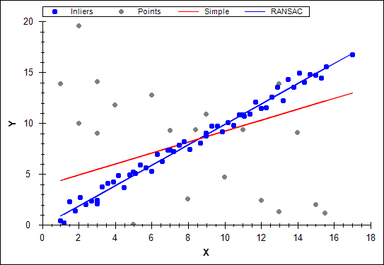

# Ejercicio 1
**¿Cuál es la transformación más fuerte de la geometría de una escena que puede introducirse al tomar una foto de ella? Dar algún ejemplo.**

Proyección es la transformación geométrica que buscamos ya que elimina el paralelismo y modifica los ángulos y las proporciones. Por ejemplo: aunque sabemos que las vías de tren son paralelas, si tratamos de observar su final vemos que se cortan en la lejanía. Este punto de corte lo situamos en el infinito y toma el nombre de punto impropio. Esto se debe una proyección geométrica hacia un punto de fuga.

# Ejercicio 2
**Por qué es necesario usar el plano proyectivo para estudiar las transformaciones en las imágenes de fotos de escenas? Dar algún ejemplo.**

El plano proyectivo nos ayuda a entender cómo es la composición real de la fotografía, quiero decir, cómo son en realidad y cómo se disponen en el espacio los objetos capturados en la imagen.  
El espacio proyectivo nos permite estudiar geometrías afín tan solo fijando una recta (recta del infinito) en el espacio proyectivo, también podemos ver geometrías euclídeas fijando dos puntos complejos en la recta anteriormente mencionada e incluso podemos observar geometría hiperbólica.  
Todo esto nos sirve para generalizar enunciados geométricos y facilitar el tratamiento de la información de nuestras imágenes. Por ejemplo, como hemos dicho antes, dos líneas siempre se cortan excepto cuando son paralelas. Esto en el plano proyectivo no es así, estas rectas paralelas intersecan en el infinito y la resolución de esta intersección es igual al de un caso en el que ambas rectas son claramente secantes.

# Ejercicio 3
**Sabemos que en el plano proyectivo un punto no existe en el sentido del plano afín, sino que se define por una clase de equivalencia de vectores definida por $\{k(x,y,1),k\neq0\}$. Razone usando las coordenadas proyectivas de los puntos afines de una recta que pase por el (0,0) del plano afín y verifique que los punto de la recta del infinito del plano proyectivo son necesariamente vectores del tipo (\*,\*,0) con \*=cualquier número.**

# Ejercicio 4
**¿Qué propiedades de la geometría de un plano quedan invariantes cuando se toma una foto de él? Justificar la respuesta.**

Las propiedades de un plano en transformaciones lineales son:  

- El origen se asigna a un origen
- Las líneas se asignas a líneas
- Las líneas paralelas se mantienen paralelas
- Las proporciones se conservan
- Cerrado bajo composición

Una cámara, al igual que nuestro ojo, realiza una proyección de la imagen que captura invirtiéndola. Por lo tanto pasamos a hablar de transformaciones afín, lo que significa que la primera propiedad es la única que no se conserva.

Podemos ver más sobre el tema en:  

[Camera geometry and image alignment - Josef Sivic](http://www.ens-lyon.fr/LIP/Arenaire/ERVision/camera_geometry_alignment_final.pdf)

# Ejercicio 5
**En  coordenadas  homogéneas  los  puntos y  rectas  del  plano  se representan  por  vectores  de  tres  coordenadas(notados  x  y  l respectivamente), de manera que si una recta contiene a un punto se verifica la ecuación $x^Tl=0$, es decir $\left(x_{1}, x_{2}, x_{3}\right)\left(\begin{array}{l}{a} \\{b} \\{c}\end{array}\right)=0$. Considere una homografía H que transforma vectores de puntos, $x'=Hx$. Dado que una homografía transforma vectores de tres coordenadas también existen homografías G para transformar vectores de rectas $l'=Gl$. Suponga una recta l y un punto x que verifican $x^Tl=0$ en el plano proyectivo y suponga  que  conoce  una  homografía  H  que transforma vectores  de puntos. En estas condiciones ¿cuál es la homografía G que transforma los vectores de las rectas? Deducirla matemáticamente.**

# Ejercicio 6
**¿Cuál es el mínimo número de escalares necesarios para fijar una homografía general? ¿Y si la homografía es afín? Justificar la respuesta**

Para una homografía general el mínimo de escalares a fijar sería de 8 ya que, de 9 escalares que consta la matriz, el que ocupa la posición (3,3) siempre vale 1.
$$
\begin{pmatrix}
 a & b & c\\ 
 d & e & f \\ 
 g & h & 1
\end{pmatrix}
$$
En el caso de la homografía afín la última fila siempre es (0,0,1) por lo que el número de escalares a fijar es 6.
$$
\begin{pmatrix}
 a & b & c\\ 
 d & e & f \\ 
 0 & 0 & 1
\end{pmatrix}
$$

# Ejercicio 7
**Defina una homografía entre planos proyectivos que haga que el punto (3,0,2) del plano proyectivo-1 se transforme en un punto de la recta del infinito del plano proyectivo-2? Justificar la respuesta**

Para proyectar (3,0,2) a la recta del infinito del plano proyectivo-2 sabemos que su tercera coordenada debe pasar a valer  0. De modo que, si aplicamos una homografía sería de la siguiente manera:

$$
\begin{pmatrix}
 a & b & c\\ 
 d & e & f \\ 
 g & h & i
\end{pmatrix}\cdot \begin{pmatrix}
3\\ 
0\\ 
2
\end{pmatrix}= \begin{pmatrix}
x\\ 
y\\ 
0
\end{pmatrix}
$$

De modo que el punto resultante tendría los siguinetes valores:
$$x = 3a + 0b + 2c$$
$$y = 3d + 0e + 2f$$
$$0 = 3g + 0h + 2i$$

Pero, como hemos dicho, solo nos interesa que el tercer valor sea 0. Por lo tanto resolviendo la última ecuación tenemoso que
$$3g + 2i = 0$$
$$g = -\frac{2i}{3}$$
Como i siempre vale 1 tenemos que:
$$g = -\frac{2}{3}$$

Para proyectar (3,0,2) sobre la recta del infinito del plano proyectivo-2 debemos usar cualquier homografía siempre y cuando el valor de _g_ sea $-\frac{2}{3}$.

# Ejercicio 8
**Una homografía general $\mathrm{H}=\left(\begin{array}{lll}{a} & {b} & {c} \\{d} & {e} & {f} \\{g} & {h} & {i}\end{array}\right)=\left[\begin{array}{ll}{\mathrm{A}} & {\mathrm{t}} \\{\mathrm{v}^{T}} & {v}\end{array}\right]$, $det(H)\neq 0$ admite una descomposición única en movimiento elementales de la siguiente forma $H=H_sH_AH_P$ donde $H_s$ representa la homografía de una similaridad (escala, giro y traslación), $H_A$ la homografía de un movimiento afín puro y  $H_P$ una transformación proyectiva pura. Es decir,**
$$
\begin{aligned}
\mathbf{H}_{s}=\left(\begin{array}{ccc}
{s \cos \theta} & {-s \sin \theta} & {t_{x}} \\
{s \sin \theta} & {s \cos \theta} & {t_{y}} \\
{0} & {0} & {1}
\end{array}\right) \equiv\left[\begin{array}{ccc}
{s \mathbf{R}} & {\mathbf{t}} & {} \\
{\mathbf{0}^{T}} & {1}
\end{array}\right], s>0, \quad \mathbf{H}_{A}=\left(\begin{array}{ccc}
{a} & {c} & {0} \\
{0} & {b} & {0} \\
{0} & {0} & {1}
\end{array}\right) \equiv\left[\begin{array}{cc}
{\mathbf{K}} & {\mathbf{0}} \\
{\mathbf{0}^{T}} & {1}
\end{array}\right], \operatorname{det}(\mathbf{K})=1 \\
\mathbf{H}_{p}=\left(\begin{array}{ccc}
{1} & {0} & {0} \\
{0} & {1} & {0} \\
{v_{1}} & {v_{2}} & {v}
\end{array}\right) \equiv\left[\begin{array}{cc}
{\mathbf{I}} & {\mathbf{0}} \\
{\mathbf{v}^{T}} & {v}
\end{array}\right], v \neq 0
\end{aligned}
$$
**Describir un algoritmo que permite encontrar las matrices de la descomposición de una matriz H dada. Aplicarlo para encontrar la descomposición de**
$$H=\left(\begin{array}{ccc}
{1.707} & {0.586} & {1.0} \\
{2.707} & {8.242} & {2.0} \\
{1.0} & {2.0} & {1.0}
\end{array}\right)$$

# Ejercicio 9
**¿Cuáles son las propiedades necesarias y suficientes para que una matriz defina un movimiento geométrico no degenerado entre planos? Justificar la respuesta.**

Se deben cumplir dos propiedades:

- La matriz ha de ser 3x3.
- El determinante de la matriz debe ser distinto de 0.

Al trabajar con puntos de dimensionalidad 3x1 necesitamos una matrix 3x3 que mantenga la dimensionalidad (3x3 * 3x1 = 3x1).

La segunda característica se debe a que la proyección debe ser reversible o bidireccional, es decir, debemos poder proyectar un punto **P** del plano **Pl** a un punto **P'** del plano **Pl'** mediante una matriz $M$ y hacer la proyección en sentido contrario con la matriz inversa $M'$. Para poder calcular $M'$ el determinante de $M$ debe ser distinto de 0.

# Ejercicio 10
**¿Qué información de la imagen usa el detector de Harris para seleccionar puntos? ¿El detector de Harris detecta patrones geométricos o fotométricos? Justificar la contestación.**

El detector de Harris usa información de la intensidad del gradiente.  
Se recorre la imagen con una ventana buscando cambios significativos en la intensidad del gradiente tanto en el eje X como en el Y. Si hay un gran diferencial en ambos ejes el algoritmo lo toma como un punto de Harris al que se le aplicará un umbral y tras este, una supresión de no-máximos.

El detector de Harris detecta ambos patrones, tanto geométricos como fotométricos (detección de esquinas e intensidad del gradiente), y es por ello que se muestra invariable ante algunas alteraciones en estos dos campos. Si aplicamos una rotación a la imagen (transformación geométrica) los puntos detectados no cambian al igual que tampoco lo hacen si modificamos la intensidad (tranformación fotométrica).

# Ejercicio 11
**¿Sería adecuado usar como descriptor de un punto Harris los valores de los píxeles de su región de soporte? Identifique ventajas, inconvenientes y mecanismos de superación de estos últimos**

En términos generales no sería adecuado. Pero si hablamos de casos específicos en los que las transformaciones aplicadas a una imagen mantienen invariantes los puntos de Harris (como las rotaciones) podría aportar ventajas como más simplicidad a la hora de aplicar el algoritmo de detección.  
Como inconveniente tenemos lo anteriormente mencionado: si realizamos transformaciones en las que el detector de Harris sea variante como en el escalado de la imagen, el descriptor de la región de soporte sería inservible (los píxeles cambian debido al interpolado de valores y/o eliminación de filas y columnas). Además, ante variaciones de intensidad de los píxeles, el descriptor por defecto de Harris es parcialmente invariante, característica que no se mantiene si usamos su región de soporte como descriptor.  
Respecto a la solución de estos inconvenientes trataremos sólo el de la intensdidad ya que el problema de ser variante ante el escalado es también una propiedad del descriptor original. Bien pues, para tratar de solucionar el problema de la intensidad podríamos normalizar los valores de la imagen de modo que, independientemente de la intensidad de la imagen los valores se mantendrían.

# Ejercicio 12
**Describa un par de criterios que sirvan para seleccionar parejas de puntos en correspondencias ("matching") a partir de descriptores de regiones extraídos de dos imágenes. ¿Por qué no es posible garantizar que todas las parejas son correctas?**

**Fuerza bruta**: Este método calcula la distancia entre el descriptor origen y los descriptores de la imagen destino y selecciona el match más cercano (según la distancia euclídea). Su ventaja es su gran simpleza, y como inconveniente tenemos su poca precisión: en casos donde se puedan encontrar objetos parecidos en las imágenes, puede errar en los matches como por ejemplo en una imagen de una valla. Podemos mejorar este método aplicando un umbral de manera que escoja el match que le correspondería solo si este multiplicado por el umbral da una distancia menor que el siguiente match más cercano.

**HAMMING**: Este método se usa en aquellos casos en los que medimos la distancia entre datos binarios. Este criterio se usa por ejemplo en los descriptores ORB, BRIEF o BRISK. Esta distancia cuenta el número de dígitos binarios distintos entre descriptores.

No es posible garantizar que todas las parejas serán correctas ya que es más que posible que los KeyPoints a relacionar en ambas imágenes no concuerden, es decir que haya KeyPoints que realmente no tienen una pareja correcta y cualquiera asignada por tanto será errónea. Otra posibilidad es que debido a la búsqueda del más cercano es posible que seleccionemos un match inadecuado debido a similitudes en la imagen y que realmente el correcto fuera el siguiente posible match. Justo esto es lo que se trata de evitar conla mejora del umbral en el caso de _fuerza bruta_ que, por cierto, también es aplicable en la distancia Hamming.

# Ejercicio 13
**Cual es el objetivo principal del uso de la técnica RANSAC en el cálculo de una homografía. Justificar la respuesta**

El objetivo es desechar los puntos que se alejan significativamente de la media de puntos observados (outliers) y realizar el ajuste únicamente con los puntos inliers (los que si corresponden con el valor esperado o uno cercano dentro de un umbral). Esto lo hace para hacer un ajuste con los puntos que se consideran realmente buenos y no con los puntos que pueden perjudicarnos a la hora de hacer el ajuste para calcular la homografía ya que los outliers alteran significativamente los resultados, sobretodo cuanto más alejados están de los inliers como vemos en la siguiente imagen:  

Vemos que de no aplicar RANSAC el resultado no se ajustaría a la realidad.  

# Ejercicio 14
**Si tengo 4 imágenes de una escena de manera que se solapan la 1-2, 2-3 y 3-4. ¿Cuál es el número mínimo de parejas de puntos en correspondencias necesarios para montar un mosaico? Justificar la respuesta**

Para aplicar una homografía entre dos imágenes necesitamos, por lo menos, cuatro 'matches' (cuatro parejas de puntos en correspondencia, cuatro puntos por imagen). Como debemos enlazar cuatro imágenes, es decir, necesitamos realizar tres homografías, necesitamos doce parejas de puntos en correspondencias.

# Ejercicio 15
**¿En la confección de un mosaico con proyección rectangular es esperable que aparezcan deformaciones geométricas de la escena real? ¿Cuáles y por qué? ¿Bajo qué condiciones esas deformaciones podrían no estar presentes? Justificar la respuesta.**

Las deformaciones son más que esperables si las imágenes no han sido tomadas en el mismo plano. Al transportar todas las imágenes del mosaico a un determinado plano se deforman todas aquellas que no pertenezcan a él realmente. Además estas deformaciones son acumulativas entre las imágenes transportadas al plano. Supongamos que unimos una imagen _im1_ a una imagen _im2_ de manera que el lado derecho de _im2_ queda conectado al lado izquierdo de _im1_ y esto lo hacemos sobre el plano de _im2_. el resultado será una leve deformación en el lado de la unión y una deformación más notable en el lado que quedó libre (en este caso el derecho). Esta deformación da la sensación de que la imagen se acerca formando un efecto envolvente sobre el observador.

Podemos evitar las deformaciones si tomamos las imágenes en el mismo plano. Por ejemplo tomar todas las fotografías/imágenes en el eje X no supondría ninguna deformación a la hora de realizar un mosaico. Si por el contrario no podemos cumplir esta condición, empezar el mosaico por la imagen que ocupa la posición central de la composición ayudará a disminuir las deformaciones ya que serán repartidas entre el resto de imágenes que quedan a los lados y no se acumularán en el extremo como pasaría si empezamos por la imagen inicial o final.

# Bibliografía

[Ejercicio 2](https://es.wikipedia.org/wiki/Espacio_proyectivo)  
[Ejercicio 4](http://www.ens-lyon.fr/LIP/Arenaire/ERVision/camera_geometry_alignment_final.pdf)